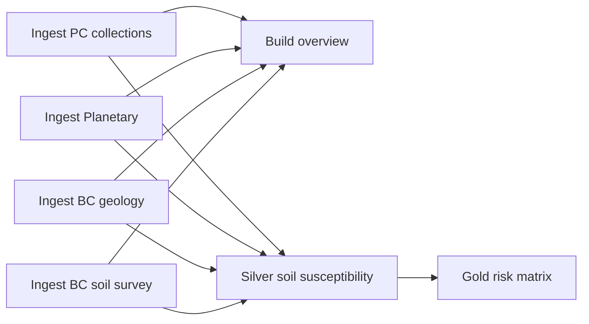

> **Provenance.** Forked from [`yus-git/geohazard-demo`](https://github.com/yus-git/geohazard-demo)
> at branch `dev-pc-done` (commit `0634161`, 2026-08-05, Yusra Adil and Alex Acar).
>
> Added here: `silver_source_features`, source-feature identity carried through silver,
> `gold_rf1_risk_hotspots`, run scoping on every table, `agent_handoff_publisher`, a
> Fabric Environment replacing inline `%pip`, portable Python provisioning and run
> scripts, and [DEMO_RUNBOOK.md](DEMO_RUNBOOK.md). See
> [Grounding the report agent in the spatial data](#grounding-the-report-agent-in-the-spatial-data)
> for why.

## Overview

An end-to-end Microsoft Fabric demo that ingests public geospatial data and builds a
**bronze → silver → gold** medallion pipeline for a geohazard screening workflow. It
shows realistic data-engineering patterns (parameterized ingestion, Delta lakehouses,
pipeline orchestration) together with CI/CD controls (Git integration and a Fabric
deployment pipeline).

The default worked example is **RF-1 soft-soil susceptibility** over Maple Ridge,
British Columbia. A pipeline run can select another latitude, longitude, catalog
radius, and detailed analysis radius. Planetary Computer sources have broad coverage;
DataBC geology and soil layers are specific to British Columbia and can be empty for
other locations.

## Medallion architecture

| Layer | Notebook | Lakehouse | What it produces |
| --- | --- | --- | --- |
| **Bronze** | `bronze_pc_collections`, `bronze_bc_surficial_geology`, `bronze_bc_soil_survey`, `bronze_data_overview` | `bronze_lakehouse` | STAC item + WFS feature **metadata** (satellite, geology, soil survey) catalogued into Delta tables; folium overview maps |
| **Silver** | `silver_source_features` | `silver_lakehouse` | Bronze GeoJSON flattened to one queryable row per source feature: typed attributes, centroid, bbox, area, distance from AOI, plus per-source coverage status |
| **Silver** | `silver_rf1_soil_susceptibility` | `silver_lakehouse` | AOI pixels clipped to a 10 m grid; RF-1 factor metrics, surveyed soil ground truth, per-pixel S/C ratings, and the **source feature identity** each pixel sits on |
| **Gold** | `gold_rf1_risk_matrix` | `gold_lakehouse` | Risk tables, **ranked hotspots with spatial attribution**, dissolved risk-area polygons, GeoJSON/Shapefile exports, manifest, and interactive web map |
| **Gold** | `agent_handoff_publisher` | `gold_lakehouse` | Validated `report-input.json` evidence envelope for the Foundry report agent |

```text
bronze (catalogue metadata)  ─►  silver (flatten + clip + score)  ─►  gold (risk, hotspots)  ─►  agent handoff
```

Every table is partitioned by `run_id`, so one workspace can hold many screening runs
and every query — including the data agent's — can be scoped to a single run.

`bronze_planetary_ingestion` is a standalone single-collection ingestion demo
(`sentinel-2-l2a` → `bronze_satellite_stac_items`) kept for the simplest possible
parameterized-notebook example.

## Repo structure

```text
fabric/
  notebooks/
    bronze_pc_collections.ipynb          # Planetary Computer STAC → 7 bronze tables
    bronze_bc_surficial_geology.ipynb    # DataBC WFS → 3 bronze geology tables
    bronze_bc_soil_survey.ipynb          # DataBC WFS (SIFT) → bronze soil survey tables
    bronze_data_overview.ipynb           # reads bronze tables, renders folium maps
    bronze_planetary_ingestion.ipynb     # single-collection parameterized demo
    bronze_pc_sentinel1.ipynb            # Sentinel-1 RTC + GRD metadata (standalone)
    silver_source_features.ipynb         # flatten bronze GeoJSON → queryable features
    silver_rf1_soil_susceptibility.ipynb # clip + extract pixels, compute S/C ratings
    gold_rf1_risk_matrix.ipynb           # risk scoring, hotspots, exports, and web map
    agent_handoff_publisher.ipynb        # validated evidence envelope for the agent
  pipelines/
    pl_bronze_ingestion.json             # complete bronze, silver, and gold orchestration
cicd/
  fabric-setup.config.json              # provisioning inputs
  fabric-setup.output.json              # generated provisioning summary (IDs)
  parameters.dev.json / parameters.prod.json
  promotion-checklist.md
docs/
  data-sources.md                       # every external source, endpoint, and table
  workload-context-geohazard.md         # RF-1..RF-10 geohazard linkage
scripts/
  fabric/
    setup_fabric_demo.ps1               # provisions workspace, lakehouses, notebooks, pipelines
    provision_fabric_demo.py            # same provisioning, portable (Python + az CLI)
    run_pipeline.py                     # starts pl_bronze_ingestion and polls to completion
    run_notebooks.ps1                   # runs notebooks on demand
agent-architecture/
  README.md                             # Foundry report + deterministic web-map design
  contracts/                            # strict report and map JSON Schemas
  prompts/                              # grounded report-agent system instructions
```

## Data sources

All sources are **public and anonymous** (no keys or token signing) and anchor on the
same Area of Interest. Only metadata/pixels are read on demand — underlying rasters are
not downloaded into bronze.

| Source | Protocol | Layers / collections | Notebook |
| --- | --- | --- | --- |
| Microsoft Planetary Computer STAC | `POST /search` | 7 collections (Sentinel-1/2, Copernicus DEM, ESA WorldCover, IO LULC, ALOS PALSAR, HGB) | `bronze_pc_collections` |
| BC DataBC (BC Geographic Warehouse) | WFS 2.0.0 `GetFeature` | Quaternary geology, bedrock, faults | `bronze_bc_surficial_geology` |
| BC DataBC — Soil Information Finder Tool (SIFT) | WFS 2.0.0 `GetFeature` | Soil survey polygons, project boundaries | `bronze_bc_soil_survey` |

Default AOI: Maple Ridge, BC, centre `49.2193, -122.5984`, 20 km bronze
catalog radius, and 3 km detailed analysis radius. Full details are in
`docs/data-sources.md`.

## Grounding the report agent in the spatial data

Bronze deliberately stores each WFS feature as verbatim `geometry_json` /
`properties_json`. That preserves raw fidelity, but neither SQL nor a Fabric data agent
can parse GeoJSON text — so bronze on its own cannot answer a spatial question. Three
things close that gap:

1. **`silver_source_features`** flattens every bronze vector feature once into typed,
   queryable columns — `drainage_class`, `parent_material`, `texture`, `rock_type`,
   `fault_type`, plus `centroid_lat/lon`, `area_km2`, and `distance_from_aoi_km`.
   Attributes are resolved by token-boundary matching against the real property keys, so
   a DataBC schema change degrades to nulls instead of breaking the run.
2. **Feature identity travels with the pixels.** Silver burns the soil and
   surficial-geology polygon indices onto the same 10 m grid as the risk score, so every
   pixel knows which mapped unit it sits on (`soil_poly_id`, `geology_poly_id`, joined
   through `silver_rf1_poly_lookup`).
3. **`gold_rf1_risk_hotspots`** clusters contiguous High/Extreme pixels into ranked,
   stably-identified features (`hs-001`, `hs-002`, …) and attaches the *why*: dominant
   soil unit and drainage class, surficial geology unit, land cover, mean slope, and the
   exact distance to the nearest mapped fault.

Together these let the agent answer questions the gold aggregates alone cannot:

* *Which soil units underlie the Extreme risk area, and how are they drained?*
* *What is the highest-ranked hotspot, and what is it sitting on?*
* *How far is the nearest mapped fault from hotspot `hs-003`?*
* *Which configured sources returned no records for this run?*
* *What surficial materials are mapped within 2 km of the AOI centre?*

`agent_handoff_publisher` then packages one run into the versioned
`report-input.json` contract — every number carrying an `evidenceId` — and refuses to
publish if the gold tables disagree on totals or any reference is malformed.

## Provisioned identifiers

Workspace `Englobecorp_Geohazard` = `a7d0f907-bf14-4169-8d34-b8765824aa09`. Resolved IDs
are recorded in `cicd/fabric-setup.output.json`.

| Item | Display name | ID |
| --- | --- | --- |
| Lakehouse | `bronze_lakehouse` | `fbdd7d1d-00a2-4e0f-84f8-655fce72e4c9` |
| Lakehouse | `silver_lakehouse` | `7818d0c8-eacb-4599-a91c-68d795175857` |
| Lakehouse | `gold_lakehouse` | `05034b20-db81-4356-8b7c-dbf6ac86f929` |
| Data pipeline | `pl_bronze_ingestion` | `1bcd4990-7fca-4e8b-a356-c5f20405a5dc` |
| Deployment pipeline | `geohazard-demo-single-pipeline` | `965750c8-3575-4cb9-855d-82ada8c65a75` |
| Notebook (PC) | `bronze_pc_collections` | `2ea8d23a-e499-412b-a096-ec78ebe08145` |
| Notebook (BC) | `bronze_bc_surficial_geology` | `4cc8d648-1183-4a7a-85dd-d1f9bf5ea91b` |
| Notebook (soil) | `bronze_bc_soil_survey` | _resolved on next `setup_fabric_demo.ps1` run_ |
| Notebook (map) | `bronze_data_overview` | `e6047d17-ef87-4aaa-b044-d07acdc41d6e` |

> Each notebook must have its layer lakehouse set as the **default lakehouse** (stored in
> the notebook's `metadata.dependencies.lakehouse`). Without it, relative `saveAsTable` /
> `spark.read.table` calls fail and the Spark session is cancelled.

## Deploy guides

Two beginner-friendly, step-by-step guides cover the full deployment from scratch:

* [DEPLOY_AUTOMATED.md](DEPLOY_AUTOMATED.md) covers prerequisites, scripted
  provisioning, and one complete default Maple Ridge pipeline run.
* [DEPLOY_MANUAL.md](DEPLOY_MANUAL.md) covers the browser-first equivalent, running
  the seven notebooks in the same bronze, silver, and gold order.

The condensed provisioning and run steps are below; use the guides above for the full
walkthrough with placeholders to fill in for your own tenant.

## Setup — provision the foundation

A PowerShell script provisions the workspace, three lakehouses, seven notebooks, the
complete data pipeline, and the deployment pipeline. It is idempotent: existing items
are updated rather than recreated.

```powershell
.\scripts\fabric\setup_fabric_demo.ps1 -ConfigPath ".\cicd\fabric-setup.config.json" -OutputPath ".\cicd\fabric-setup.output.json"
```

Prerequisites:

* Azure CLI signed in: `az login` (tenant `711a9076-1115-4c36-b7b4-82b4f3a05f6f`).
* The Fabric capacity backing the workspace must be **Active** (not paused):

  ```powershell
  az fabric capacity resume --resource-group rg-fabric --capacity-name cpfabric
  ```

## Run the Complete Medallion Pipeline

`pl_bronze_ingestion` runs the four AOI ingestions in parallel. Overview and silver
then start independently, and gold starts after silver succeeds:



In the Fabric portal, select **Run** without changing any values to execute the full
Maple Ridge workflow. The deployed defaults are `49.2193`, `-122.5984`, a 20 km bronze
catalog radius, and a 3 km silver analysis radius. Fabric passes the catalog AOI to all
four ingestion notebooks and the overview. Silver receives the same centre point plus
the detailed radius, then selects the local UTM zone. Gold starts automatically after
silver succeeds.

Override `LATITUDE`, `LONGITUDE`, `RADIUS_KM`, or `ANALYSIS_RADIUS_KM` only when you
want another AOI. The analysis radius must be greater than 0 and no more than 5 km for
the 10 m demo grid.

Deployment defaults come from the file named by `dataPipeline.parametersPath` in
`cicd/fabric-setup.config.json`. It currently points to `cicd/parameters.dev.json`.
Change that property to `cicd/parameters.prod.json` before provisioning to deploy the
production defaults. Users can still override the deployed defaults for each run.

Run the whole pipeline from PowerShell:

```powershell
$state = Get-Content ./cicd/fabric-setup.output.json -Raw | ConvertFrom-Json
$ws    = [string]$state.workspace.workspaceId
$plid  = [string]$state.dataPipeline.id
$base  = "https://api.fabric.microsoft.com/v1"
$token = az account get-access-token --resource "https://api.fabric.microsoft.com" --query accessToken -o tsv
$h     = @{ Authorization = "Bearer $token" }

# Start the pipeline
$r   = Invoke-WebRequest -Method Post -Uri "$base/workspaces/$ws/items/$plid/jobs/instances?jobType=Pipeline" -Headers $h -Body '{}' -ContentType 'application/json'
$loc = @($r.Headers['Location'])[0]

# Poll to completion
do {
    Start-Sleep 20
    $token = az account get-access-token --resource "https://api.fabric.microsoft.com" --query accessToken -o tsv
    $h = @{ Authorization = "Bearer $token" }
    $j = Invoke-RestMethod -Uri $loc -Headers $h
    $j.status
} while ($j.status -in "NotStarted","InProgress","Running")
"FINAL: $($j.status)"   # expect: Completed
```

Validate the run in **Workspace > Monitor**. The parent pipeline must be `Completed`
and all seven activities must be `Succeeded`. Confirm the silver lakehouse contains
`silver_rf1_soil_susceptibility` and the gold lakehouse contains
`gold_rf1_risk_pixels`, `gold_rf1_risk_matrix`, `gold_rf1_band_summary`, and
`gold_rf1_risk_areas`. Preview the risk-pixels table and confirm its default `aoi_name` is
`AOI 49.2193, -122.5984`.

### Run One Notebook for Troubleshooting

```powershell
.\scripts\fabric\run_notebooks.ps1 -Notebooks gold_rf1_risk_matrix
```

Do not use the no-argument helper for a normal end-to-end run. It submits notebooks
without the data pipeline's dependency ordering.

## Silver and Gold Outputs

The complete pipeline runs these analytics notebooks automatically:

1. `silver_rf1_soil_susceptibility` clips the AOI to a 10 m grid in the local UTM
  zone, pulls Planetary Computer COG pixels, computes RF-1 factor metrics, rasterizes
  BC soil-survey polygons as soft-soil ground truth, and writes per-pixel S and C
  ratings. The soil survey carries the largest weight in S.
2. `gold_rf1_risk_matrix` calculates `risk_score = S × C` (1–25) and assigns Low,
  Moderate, High, or Extreme bands.

The gold notebook writes:

* `gold_rf1_risk_pixels`: per-pixel risk score and band with coordinates
* `gold_rf1_risk_matrix`: the 5×5 S×C grid with pixel count, mean risk, and band
* `gold_rf1_band_summary`: area and share per risk band
* `gold_rf1_risk_areas`: one dissolved GeoJSON geometry per populated risk band

Each pipeline run also writes these files under
`gold_lakehouse/Files/gold_rf1_webmap/runs/<pipeline-run-id>/`:

* `gold_rf1_webmap.html`: interactive risk-area map with matching legend and popups
* `gold_rf1_risk_areas.geojson`: bounded risk-area FeatureCollection
* `gold_rf1_risk_areas.shp`, `.shx`, `.dbf`, `.prj`, and `.cpg`: Shapefile components
* `gold_rf1_risk_areas_shapefile.zip`: portable Shapefile bundle
* `gold_rf1_webmap_manifest.json`: viewport, layers, legend, and provenance
* `_SUCCESS`: completion marker written after artifact validation

## Foundry report and web-map architecture

The [agent architecture](agent-architecture/README.md) defines an implementation-ready
Microsoft Foundry report agent, strict evidence and report contracts, a Fabric data
agent boundary, and a deterministic interactive web-map design. It intentionally does
not deploy an application. The model explains validated Fabric evidence; Spark and the
map adapter remain responsible for scores, coordinates, geometry, bounds, and layers.

## CI/CD path

* **Git integration** — commit notebook and pipeline changes through Fabric's source
  control to version the workspace.
* **Deployment pipeline** — `geohazard-demo-single-pipeline` has the workspace assigned
  to stage 0. Assign additional workspaces to later stages for true cross-stage
  promotion. See `cicd/promotion-checklist.md` and `cicd/parameters.{dev,prod}.json`.

## Cost — pause when finished

```powershell
az fabric capacity suspend --resource-group rg-fabric --capacity-name cpfabric
```

## Scope note

This repo demonstrates ingestion and medallion engineering patterns plus a worked RF-1
risk model. The RF-1 ratings use availability-weighted proxies over public data for
illustration; production hazard scoring would extend the silver/gold layers with field
data and calibrated models. Geohazard RF-1..RF-10 context is in
`docs/workload-context-geohazard.md`.
