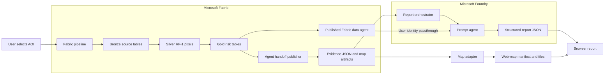

## Goals

* Run the geohazard pipeline for a user-selected AOI
* Generate a readable report whose quantitative claims trace to Fabric evidence
* Show the risk surface and supporting source layers on an interactive web map
* Preserve identity, provenance, and run isolation from ingestion through presentation

The design does not make the language model a geospatial computation engine. Spark
calculates risk, aggregation, hotspots, geometries, bounds, and map artifacts. Foundry
only organizes and explains those deterministic results.

## Logical architecture

## Components

| Component | Responsibility | Trust rule |
| --- | --- | --- |
| Fabric pipeline | Parameter validation and notebook orchestration | One run ID and AOI per execution |
| Gold lakehouse | Authoritative scores, bands, matrix, and coordinates | No model-written records |
| Agent handoff publisher | Aggregates evidence and emits versioned contracts | Reject incomplete or inconsistent runs |
| Fabric data agent | Answers bounded follow-up questions over approved tables | End-user identity and source permissions apply |
| Foundry prompt agent | Produces structured narrative from evidence | Cite evidence; never infer missing values |
| Report validator | Checks schema, evidence IDs, feature IDs, and totals | Fail closed before presentation |
| Map adapter | Publishes raster/vector assets and manifest | Geometry and URLs remain deterministic |
| Browser | Joins report sections to map feature references | Treat all text and properties as untrusted content |

## Data flow

1. The user supplies `LATITUDE`, `LONGITUDE`, `RADIUS_KM`, and
   `ANALYSIS_RADIUS_KM` to the Fabric pipeline.
2. Bronze notebooks catalog source coverage. Silver computes the detailed local-UTM
   grid. Gold writes risk pixels, risk matrix, and band summary.
3. A future handoff notebook assigns a `runId`, checks that all gold rows belong to the
   same AOI, and computes bounded hotspots with deterministic tie-breaking.
4. The handoff notebook writes report input and map manifest JSON plus map-ready files
   under a run-specific OneLake folder.
5. The report orchestrator validates the input schema before calling Foundry.
6. The Foundry prompt agent can use the published Fabric data agent for approved
   aggregate follow-up queries. It does not retrieve the full pixel table.
7. Foundry returns JSON matching the report-output contract.
8. The report validator rejects unknown citations, invalid feature references,
   inconsistent totals, or non-schema fields.
9. The browser renders validated report JSON beside layers from the map manifest.

## Foundry choice

Use a versioned Foundry prompt agent for this bounded synthesis task. Start with a
`gpt-4.1-mini` deployment and structured output. The agent needs one tool: the
Microsoft Fabric data agent connection. Clear tool instructions must name the approved
geohazard tables and query types.

The Fabric data-agent integration is currently preview. It requires a published Fabric
data agent, a same-tenant Foundry project, `Foundry User` for developers and users, and
appropriate access to every underlying Fabric source. It uses user identity
passthrough and does not support service-principal authentication.

For unattended report generation, bypass the preview tool. Supply the deterministic
handoff JSON directly to the model through a workload identity and Entra ID. This batch
path has the same input/output contracts and does not depend on user delegation.

## Security and governance

* Use Microsoft Entra ID instead of API keys
* Scope Foundry roles at the project level where possible
* Grant the Fabric data agent read access only to approved gold and lineage objects
* Keep OneLake paths and table identifiers in server-side configuration
* Escape report text and feature properties before browser rendering
* Log run ID, model deployment/version, prompt version, schema versions, evidence IDs,
  tool calls, token usage, and validation outcome
* Retain the exact report input and output together for replay and audit

## Failure behavior

| Failure | Required behavior |
| --- | --- |
| Bronze source has no coverage | Continue when allowed; mark the source `empty` and add a data gap |
| Silver or gold fails | Do not publish handoff artifacts or invoke Foundry |
| Totals disagree across gold tables | Quarantine the run and report a contract-validation error |
| Fabric data-agent query fails | Return the report from supplied evidence and identify the missing follow-up |
| Foundry output violates schema | Retry once with the validation error, then fail closed |
| Citation or feature ID is unknown | Reject the report before rendering |
| Map artifact is missing | Render the report with a map-unavailable state, never an invented layer |

## Run isolation and idempotency

Every handoff folder uses an immutable run ID. Publishing uses a temporary folder and
an atomic completion marker. A report can be regenerated for the same run with a new
`reportVersion`, but source evidence and map artifacts remain unchanged. The browser
only lists runs with a valid completion marker and matching schema versions.