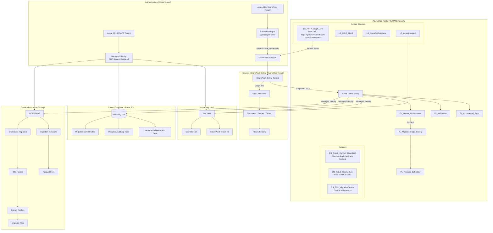
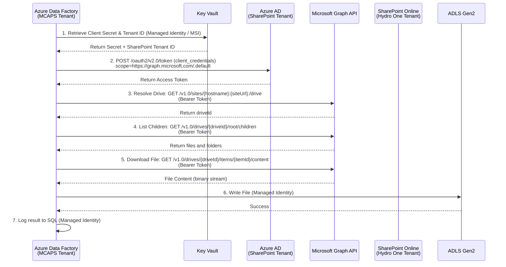
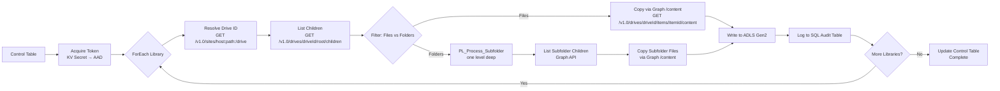
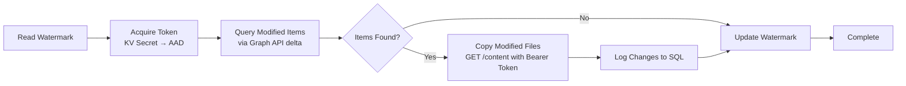

# Hydro One SharePoint to Azure Migration - Architecture Document

## Executive Summary

This document outlines the technical architecture for migrating approximately **25 TB** of data from SharePoint Online to Azure Data Lake Storage Gen2 (ADLS Gen2) for Hydro One. The solution leverages Azure Data Factory (ADF) as the orchestration engine with a metadata-driven approach for scalability and maintainability. File access is handled entirely through Microsoft Graph API, with cross-tenant authentication from the MCAPS tenant to the Hydro One SharePoint tenant.

## Solution Architecture Diagram



## Component Overview

### Source: SharePoint Online

| Component | Description |
|-----------|-------------|
| SharePoint Tenant | `https://hydroone.sharepoint.com` (separate tenant from ADF) |
| Site Collections | Multiple sites containing document libraries |
| Document Libraries | ~25 TB of files across various formats |
| API | Microsoft Graph API v1.0 (`https://graph.microsoft.com/v1.0/`) |

### Orchestration: Azure Data Factory

| Pipeline | Purpose |
|----------|---------|
| `PL_Master_Migration_Orchestrator` | Master pipeline reading from control table, iterating through libraries |
| `PL_Migrate_Single_Library` | Migrates all files from a single library, handles errors/retries |
| `PL_Process_Subfolder` | Processes one level of subfolders (ADF does not support recursive/circular pipeline references) |
| `PL_Validation` | Post-migration validation comparing source vs destination |
| `PL_Incremental_Sync` | Delta sync for ongoing synchronization |

> **Note:** ADF does not allow recursive pipeline invocations (circular references are not permitted). `PL_Process_Subfolder` handles one level of nested subfolders. For deeper nesting, additional pipeline stages or flattened enumeration via Graph API is required.

### Linked Services

| Linked Service | Type | Configuration |
|----------------|------|---------------|
| `LS_HTTP_Graph_API` | HTTP | Base URL: `https://graph.microsoft.com`, Authentication: Anonymous (Bearer token passed via request headers) |
| `LS_AzureSqlDatabase` | Azure SQL Database | Managed Identity authentication |
| `LS_AzureKeyVault` | Azure Key Vault | Managed Identity authentication |
| `LS_ADLS_Gen2` | Azure Data Lake Storage Gen2 | Managed Identity authentication |

### Datasets

| Dataset | Type | Purpose |
|---------|------|---------|
| `DS_Graph_Content_Download` | HTTP / Binary | Downloads file content from Graph API `/v1.0/drives/{driveId}/items/{itemId}/content` endpoint |
| `DS_ADLS_Binary_Sink` | ADLS Gen2 / Binary | Writes binary file content to ADLS Gen2 destination path |
| `DS_SQL_MigrationControl` | Azure SQL | Reads/writes migration control and audit data |

### Storage: Azure Data Lake Storage Gen2

| Container | Purpose |
|-----------|---------|
| `sharepoint-migration` | Primary destination for migrated files |
| `migration-metadata` | Metadata, manifests, and reporting data |

**Folder Structure:**
```
sharepoint-migration/
├── SiteName1/
│   ├── Documents/
│   │   ├── Folder1/
│   │   │   └── file1.pdf
│   │   └── file2.docx
│   └── SharedDocuments/
│       └── ...
└── SiteName2/
    └── ...
```

### Control Database: Azure SQL

| Table | Purpose |
|-------|---------|
| `MigrationControl` | Tracks all libraries to migrate with status |
| `MigrationAuditLog` | Per-file audit trail |
| `IncrementalWatermark` | High watermark for delta sync |
| `BatchLog` | Batch execution tracking |

## Authentication Flow

### Cross-Tenant Architecture

ADF runs on the **MCAPS tenant**, while SharePoint Online resides on the **Hydro One tenant**. The Service Principal (App Registration) is registered in the SharePoint tenant, and its client secret is stored in Azure Key Vault (accessible to ADF via Managed Identity). The OAuth2 token is acquired against the **SharePoint tenant's AAD token endpoint**, with the scope set to `https://graph.microsoft.com/.default`.



### Token Acquisition Details

The token is acquired via a Web Activity in ADF that POSTs to the SharePoint tenant's AAD v2.0 token endpoint:

```
POST https://login.microsoftonline.com/{sharepoint-tenant-id}/oauth2/v2.0/token

grant_type=client_credentials
&client_id={app-client-id}
&client_secret={secret-from-key-vault}
&scope=https://graph.microsoft.com/.default
```

### Authentication Methods

| Resource | Authentication Method | Identity | Tenant |
|----------|----------------------|----------|--------|
| Microsoft Graph API (SharePoint) | OAuth 2.0 client_credentials (Service Principal) | Azure AD App Registration | SharePoint (Hydro One) Tenant |
| ADLS Gen2 | Managed Identity | ADF System-Assigned MI | MCAPS Tenant |
| Azure SQL | Managed Identity | ADF System-Assigned MI | MCAPS Tenant |
| Key Vault | Managed Identity | ADF System-Assigned MI | MCAPS Tenant |

## Data Flow

### Initial Migration Flow



### Detailed Pipeline Data Flow

1. **Token Acquisition**: Web Activity retrieves client secret from Key Vault (via MSI), then POSTs to AAD token endpoint (`https://login.microsoftonline.com/{sharepoint-tenant-id}/oauth2/v2.0/token`) with `scope=https://graph.microsoft.com/.default`
2. **Drive Resolution**: Web Activity calls `GET /v1.0/sites/{hostname}:{siteRelativeUrl}:/drive` to resolve the SharePoint site's default document library to a Graph drive ID
3. **List Children**: Web Activity calls `GET /v1.0/drives/{driveId}/root/children` (or `/items/{folderId}/children` for subfolders) to enumerate files and folders
4. **Filter Files/Folders**: ForEach activity iterates results; items are filtered by `folder` vs `file` facets
5. **Copy Files via Graph /content**: Copy Activity uses `DS_Graph_Content_Download` dataset to GET `/v1.0/drives/{driveId}/items/{itemId}/content` with Bearer token authentication, streaming binary content directly to `DS_ADLS_Binary_Sink`
6. **Process Subfolders**: Folders are passed to `PL_Process_Subfolder` which repeats steps 3-5 for one level of nesting
7. **Log to SQL**: Each file copy result (success/failure, file size, duration) is logged to `MigrationAuditLog` via the SQL linked service

### Incremental Sync Flow



## Network Considerations

### Connectivity
- All traffic uses HTTPS (TLS 1.2+)
- No VPN or ExpressRoute required (public endpoints)
- ADF uses Azure Integration Runtime (Auto-resolve)
- Cross-tenant traffic flows via Microsoft Graph API public endpoints

### Conditional Access
If SharePoint is behind Conditional Access policies:
1. Exclude the Service Principal from CA policies, OR
2. Register the Service Principal as an approved app
3. Ensure IP ranges for Azure Data Factory are allowed
4. Verify cross-tenant access policies permit the Service Principal from the MCAPS tenant

### Bandwidth Estimation
| Metric | Value |
|--------|-------|
| Total Data | ~25 TB |
| Available Bandwidth | ~1 Gbps (estimated) |
| Theoretical Transfer Time | ~55 hours (unthrottled) |
| Realistic Transfer Time | 7-14 days (with throttling) |

## Throttling Mitigation Strategy

### Microsoft Graph API Limits

| Limit Type | Value | Mitigation |
|------------|-------|------------|
| Requests per 10-second window | Varies by endpoint | Parallelism control |
| HTTP 429 responses | Variable with Retry-After header | Wait activity + exponential backoff |
| File size limit | 250 GB | N/A (verify largest files) |
| Per-app throttling | Service-specific | Distribute load across time windows |

### Mitigation Approaches

1. **Parallelism Control**: Limit concurrent library migrations (default: 4)
2. **File-level Parallelism**: 10 concurrent files per library
3. **Time-of-Day Scheduling**: Run during off-peak hours (8 PM - 6 AM EST)
4. **Exponential Backoff**: Wait 30s, 60s, 120s on retry
5. **429 Detection**: Dedicated Wait activity when throttled; honor `Retry-After` header from Graph API
6. **Microsoft Engagement**: Request throttling limit increase from account team

### ADF Configuration

| Setting | Recommended Value |
|---------|-------------------|
| DIU (Data Integration Units) | 4-8 |
| Parallel Copies | 4 |
| Degree of Copy Parallelism | 10 |
| Batch Size | 10-20 libraries |

## Error Handling Strategy

### Error Categories

| Error Code | Meaning | Handling |
|------------|---------|----------|
| 401 | Unauthorized | Check token expiry, re-acquire token from AAD |
| 403 | Forbidden | Check Graph API permissions, cross-tenant consent |
| 404 | Not Found | Log and skip, file/drive may have been deleted |
| 429 | Throttled | Wait per Retry-After header, retry with backoff |
| 503 | Service Unavailable | Retry after delay |
| Timeout | Network/large file | Increase timeout, retry |
| File Locked | Checked out file | Log and retry later |

### Retry Logic
- **Max Retries**: 3 per file, 3 per library
- **Retry Interval**: Exponential backoff (30s, 60s, 120s)
- **Circuit Breaker**: Pause batch if >50% failures

## Security Considerations

### Encryption

| Layer | Method |
|-------|--------|
| In Transit | TLS 1.2+ |
| At Rest (SharePoint) | Microsoft-managed encryption |
| At Rest (ADLS) | Microsoft-managed keys (option for CMK) |
| At Rest (SQL) | TDE enabled |

### Access Control

| Resource | Access Control |
|----------|----------------|
| Microsoft Graph API | Service Principal with `Sites.Read.All`, `Files.Read.All` (Application permissions on SharePoint tenant) |
| ADLS Gen2 | Managed Identity with Storage Blob Data Contributor |
| Key Vault | Managed Identity with Key Vault Secrets User |
| SQL Database | Managed Identity with db_datareader, db_datawriter |

### Cross-Tenant Security
- Service Principal is registered in the **SharePoint (Hydro One) tenant**
- Client secret is stored in **Key Vault on the MCAPS tenant**, retrieved by ADF via Managed Identity
- Token is scoped to `https://graph.microsoft.com/.default` and acquired from the SharePoint tenant's AAD endpoint
- No direct SharePoint REST API access; all operations go through Microsoft Graph API

### Compliance
- Data residency: Canada Central region
- No PII/PHI handling required (standard documents)
- Audit logging enabled for compliance tracking

### Network Security
- Storage account: Firewall enabled, Azure services allowed
- SQL Server: Firewall enabled, Azure services allowed
- Key Vault: RBAC authorization enabled

## Monitoring & Alerting

### Monitoring Points

| Component | Monitoring Method |
|-----------|-------------------|
| ADF Pipelines | ADF Monitor, Azure Monitor |
| Migration Progress | SQL queries, PowerShell script |
| Throttling Events | Audit log (429 error codes from Graph API) |
| Storage | Storage analytics, metrics |

### Alert Thresholds

| Metric | Threshold | Action |
|--------|-----------|--------|
| Pipeline Failure | Any | Email notification |
| Throttling Rate | >10% requests | Reduce parallelism |
| Failed Files | >5% of batch | Pause and investigate |
| Storage Capacity | >90% | Expand storage |

## High-Level Deployment Architecture

```mermaid
graph TB
    subgraph "Resource Group: rg-hydroone-migration-{env} (MCAPS Tenant)"
        ADF[Azure Data Factory<br/>adf-hydroone-migration-{env}]
        ADLS[ADLS Gen2<br/>sthydroonemig{env}]
        SQL[(Azure SQL<br/>sql-hydroone-migration-{env})]
        KV[Key Vault<br/>kv-hydroone-mig-{env}]
    end

    subgraph "Azure AD - MCAPS Tenant"
        MI[Managed Identity<br/>ADF System-Assigned]
    end

    subgraph "Azure AD - SharePoint Tenant"
        SP[App Registration<br/>HydroOne-SPO-Migration]
    end

    subgraph "Microsoft Graph API"
        GRAPH[graph.microsoft.com/v1.0]
    end

    ADF --> MI
    MI --> ADLS
    MI --> SQL
    MI --> KV
    KV --> |Client Secret| SP
    SP --> |OAuth2 client_credentials| GRAPH
    GRAPH --> |drives/items/content| SPO[SharePoint Online]
```

## Environment Configuration

| Environment | Resource Group | Region |
|-------------|----------------|--------|
| Dev | rg-hydroone-migration-dev | Canada Central |
| Test | rg-hydroone-migration-test | Canada Central |
| Prod | rg-hydroone-migration-prod | Canada Central |

## Appendix: Resource Naming Convention

| Resource Type | Naming Pattern | Example |
|---------------|----------------|---------|
| Resource Group | rg-{project}-{purpose}-{env} | rg-hydroone-migration-dev |
| Storage Account | st{project}{purpose}{env} | sthydroonemigdev |
| Data Factory | adf-{project}-{purpose}-{env} | adf-hydroone-migration-dev |
| Key Vault | kv-{project}-{purpose}-{env} | kv-hydroone-mig-dev |
| SQL Server | sql-{project}-{purpose}-{env} | sql-hydroone-migration-dev |
