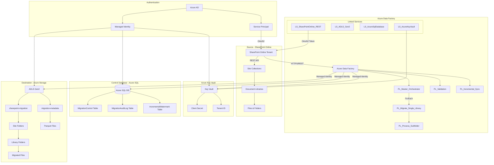
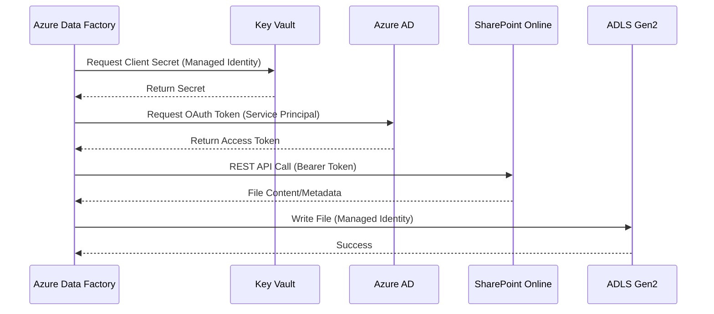
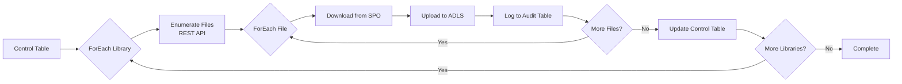
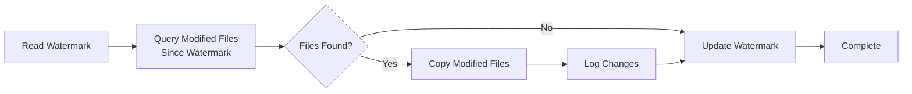

# Hydro One SharePoint to Azure Migration - Architecture Document

## Executive Summary

This document outlines the technical architecture for migrating approximately **25 TB** of data from SharePoint Online to Azure Data Lake Storage Gen2 (ADLS Gen2) for Hydro One. The solution leverages Azure Data Factory (ADF) as the orchestration engine with a metadata-driven approach for scalability and maintainability.

## Solution Architecture Diagram



## Component Overview

### Source: SharePoint Online

| Component | Description |
|-----------|-------------|
| SharePoint Tenant | `https://hydroone.sharepoint.com` |
| Site Collections | Multiple sites containing document libraries |
| Document Libraries | ~25 TB of files across various formats |
| API | SharePoint REST API v1.0 |

### Orchestration: Azure Data Factory

| Pipeline | Purpose |
|----------|---------|
| `PL_Master_Migration_Orchestrator` | Master pipeline reading from control table, iterating through libraries |
| `PL_Migrate_Single_Library` | Migrates all files from a single library, handles errors/retries |
| `PL_Process_Subfolder` | Recursive processing of nested folders |
| `PL_Validation` | Post-migration validation comparing source vs destination |
| `PL_Incremental_Sync` | Delta sync for ongoing synchronization |

### Storage: Azure Data Lake Storage Gen2

| Container | Purpose |
|-----------|---------|
| `sharepoint-migration` | Primary destination for migrated files |
| `migration-metadata` | Metadata, manifests, and reporting data |

**Folder Structure:**
```
sharepoint-migration/
├── SiteName1/
│   ├── Documents/
│   │   ├── Folder1/
│   │   │   └── file1.pdf
│   │   └── file2.docx
│   └── SharedDocuments/
│       └── ...
└── SiteName2/
    └── ...
```

### Control Database: Azure SQL

| Table | Purpose |
|-------|---------|
| `MigrationControl` | Tracks all libraries to migrate with status |
| `MigrationAuditLog` | Per-file audit trail |
| `IncrementalWatermark` | High watermark for delta sync |
| `BatchLog` | Batch execution tracking |

## Authentication Flow



### Authentication Methods

| Resource | Authentication Method | Identity |
|----------|----------------------|----------|
| SharePoint Online | OAuth 2.0 Service Principal | Azure AD App Registration |
| ADLS Gen2 | Managed Identity | ADF System-Assigned MI |
| Azure SQL | Managed Identity | ADF System-Assigned MI |
| Key Vault | Managed Identity | ADF System-Assigned MI |

## Data Flow

### Initial Migration Flow



### Incremental Sync Flow



## Network Considerations

### Connectivity
- All traffic uses HTTPS (TLS 1.2+)
- No VPN or ExpressRoute required (public endpoints)
- ADF uses Azure Integration Runtime (Auto-resolve)

### Conditional Access
If SharePoint is behind Conditional Access policies:
1. Exclude the Service Principal from CA policies, OR
2. Register the Service Principal as an approved app
3. Ensure IP ranges for Azure Data Factory are allowed

### Bandwidth Estimation
| Metric | Value |
|--------|-------|
| Total Data | ~25 TB |
| Available Bandwidth | ~1 Gbps (estimated) |
| Theoretical Transfer Time | ~55 hours (unthrottled) |
| Realistic Transfer Time | 7-14 days (with throttling) |

## Throttling Mitigation Strategy

### SharePoint Online Limits

| Limit Type | Value | Mitigation |
|------------|-------|------------|
| Requests per minute | 600 | Parallelism control |
| HTTP 429 responses | Variable | Wait activity + exponential backoff |
| File size limit | 250 GB | N/A (verify largest files) |

### Mitigation Approaches

1. **Parallelism Control**: Limit concurrent library migrations (default: 4)
2. **File-level Parallelism**: 10 concurrent files per library
3. **Time-of-Day Scheduling**: Run during off-peak hours (8 PM - 6 AM EST)
4. **Exponential Backoff**: Wait 30s, 60s, 120s on retry
5. **429 Detection**: Dedicated Wait activity when throttled
6. **Microsoft Engagement**: Request throttling limit increase from account team

### ADF Configuration

| Setting | Recommended Value |
|---------|-------------------|
| DIU (Data Integration Units) | 4-8 |
| Parallel Copies | 4 |
| Degree of Copy Parallelism | 10 |
| Batch Size | 10-20 libraries |

## Error Handling Strategy

### Error Categories

| Error Code | Meaning | Handling |
|------------|---------|----------|
| 401 | Unauthorized | Check token expiry, renew credentials |
| 403 | Forbidden | Check permissions, site-level access |
| 404 | Not Found | Log and skip, file may have been deleted |
| 429 | Throttled | Wait and retry with backoff |
| 503 | Service Unavailable | Retry after delay |
| Timeout | Network/large file | Increase timeout, retry |
| File Locked | Checked out file | Log and retry later |

### Retry Logic
- **Max Retries**: 3 per file, 3 per library
- **Retry Interval**: Exponential backoff (30s, 60s, 120s)
- **Circuit Breaker**: Pause batch if >50% failures

## Security Considerations

### Encryption

| Layer | Method |
|-------|--------|
| In Transit | TLS 1.2+ |
| At Rest (SharePoint) | Microsoft-managed encryption |
| At Rest (ADLS) | Microsoft-managed keys (option for CMK) |
| At Rest (SQL) | TDE enabled |

### Access Control

| Resource | Access Control |
|----------|----------------|
| SharePoint | Service Principal with Sites.Read.All |
| ADLS Gen2 | Managed Identity with Storage Blob Data Contributor |
| Key Vault | Managed Identity with Key Vault Secrets User |
| SQL Database | Managed Identity with db_datareader, db_datawriter |

### Compliance
- Data residency: Canada Central region
- No PII/PHI handling required (standard documents)
- Audit logging enabled for compliance tracking

### Network Security
- Storage account: Firewall enabled, Azure services allowed
- SQL Server: Firewall enabled, Azure services allowed
- Key Vault: RBAC authorization enabled

## Monitoring & Alerting

### Monitoring Points

| Component | Monitoring Method |
|-----------|-------------------|
| ADF Pipelines | ADF Monitor, Azure Monitor |
| Migration Progress | SQL queries, PowerShell script |
| Throttling Events | Audit log (429 error codes) |
| Storage | Storage analytics, metrics |

### Alert Thresholds

| Metric | Threshold | Action |
|--------|-----------|--------|
| Pipeline Failure | Any | Email notification |
| Throttling Rate | >10% requests | Reduce parallelism |
| Failed Files | >5% of batch | Pause and investigate |
| Storage Capacity | >90% | Expand storage |

## High-Level Deployment Architecture

```mermaid
graph TB
    subgraph "Resource Group: rg-hydroone-migration-{env}"
        ADF[Azure Data Factory<br/>adf-hydroone-migration-{env}]
        ADLS[ADLS Gen2<br/>sthydroonemig{env}]
        SQL[(Azure SQL<br/>sql-hydroone-migration-{env})]
        KV[Key Vault<br/>kv-hydroone-mig-{env}]
    end

    subgraph "Azure AD"
        SP[App Registration<br/>HydroOne-SPO-Migration]
        MI[Managed Identity<br/>ADF System-Assigned]
    end

    ADF --> MI
    MI --> ADLS
    MI --> SQL
    MI --> KV
    KV --> SP
```

## Environment Configuration

| Environment | Resource Group | Region |
|-------------|----------------|--------|
| Dev | rg-hydroone-migration-dev | Canada Central |
| Test | rg-hydroone-migration-test | Canada Central |
| Prod | rg-hydroone-migration-prod | Canada Central |

## Appendix: Resource Naming Convention

| Resource Type | Naming Pattern | Example |
|---------------|----------------|---------|
| Resource Group | rg-{project}-{purpose}-{env} | rg-hydroone-migration-dev |
| Storage Account | st{project}{purpose}{env} | sthydroonemigdev |
| Data Factory | adf-{project}-{purpose}-{env} | adf-hydroone-migration-dev |
| Key Vault | kv-{project}-{purpose}-{env} | kv-hydroone-mig-dev |
| SQL Server | sql-{project}-{purpose}-{env} | sql-hydroone-migration-dev |
