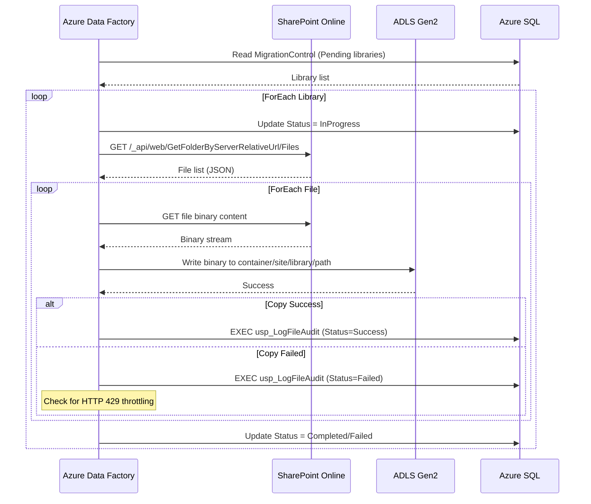
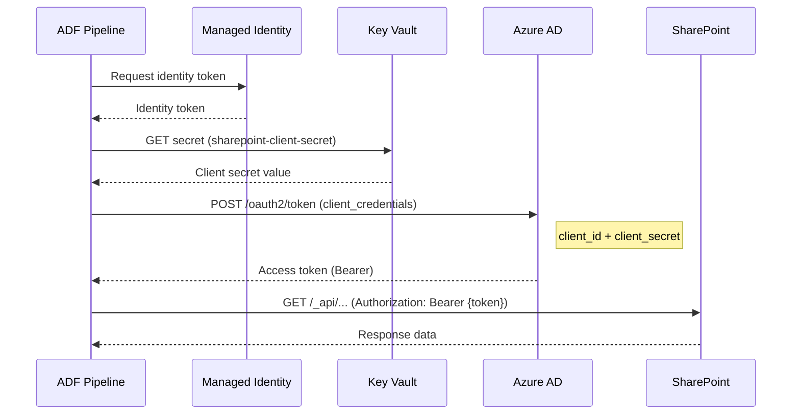
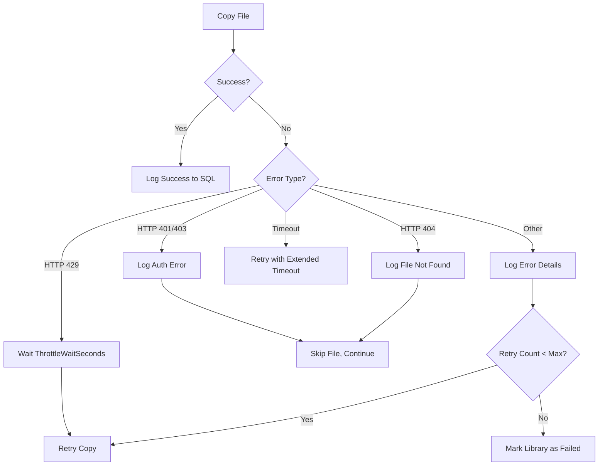

# Hydro One SharePoint Migration - Technical Pipeline & Code Documentation

## Document Information

| Field | Value |
|-------|-------|
| Project | Hydro One SharePoint to Azure Data Lake Migration |
| Version | 1.0 |
| Author | PwC Azure Data Engineering Team |
| Last Updated | February 2026 |

---

## Table of Contents

1. [Solution Architecture](#1-solution-architecture)
2. [Linked Services](#2-linked-services)
3. [Datasets](#3-datasets)
4. [Pipeline: PL_Master_Migration_Orchestrator](#4-pipeline-pl_master_migration_orchestrator)
5. [Pipeline: PL_Migrate_Single_Library](#5-pipeline-pl_migrate_single_library)
6. [Pipeline: PL_Process_Subfolder](#6-pipeline-pl_process_subfolder)
7. [Pipeline: PL_Validation](#7-pipeline-pl_validation)
8. [Pipeline: PL_Incremental_Sync](#8-pipeline-pl_incremental_sync)
9. [SQL Schema & Stored Procedures](#9-sql-schema--stored-procedures)
10. [PowerShell Scripts](#10-powershell-scripts)
11. [ARM Template Reference](#11-arm-template-reference)
12. [Data Flow Diagrams](#12-data-flow-diagrams)

---

## 1. Solution Architecture

### 1.1 High-Level Flow

```
                                 +------------------+
                                 |  Azure Key Vault |
                                 | (Client Secrets) |
                                 +--------+---------+
                                          |
+-------------------+   OAuth2    +-------+--------+   Managed ID   +------------------+
| SharePoint Online | <---------> | Azure Data     | <------------> | ADLS Gen2        |
| (25 TB Source)    |   REST API  | Factory        |   Binary Copy  | (Destination)    |
+-------------------+             +-------+--------+                +------------------+
                                          |
                                  Managed Identity
                                          |
                                 +--------+---------+
                                 |   Azure SQL DB   |
                                 | (Control/Audit)  |
                                 +------------------+
```

### 1.2 Pipeline Hierarchy

```
PL_Master_Migration_Orchestrator          <-- Top-level orchestrator
    |
    +-- ForEach Library (parallel)
         |
         +-- PL_Migrate_Single_Library    <-- Per-library migration
              |
              +-- ForEach Root File       <-- Copy files in root
              |    +-- Copy Activity
              |    +-- Log Success/Failure
              |
              +-- ForEach Subfolder
                   +-- PL_Process_Subfolder  <-- Per-folder processing
                        +-- ForEach File
                             +-- Copy Activity
                             +-- Log Success/Failure

PL_Validation                             <-- Post-migration validation
PL_Incremental_Sync                       <-- Ongoing delta sync
```

---

## 2. Linked Services

### 2.1 LS_AzureKeyVault

| Property | Value |
|----------|-------|
| Type | `AzureKeyVault` |
| Authentication | Managed Identity |
| Base URL | `https://kv-hydroone-mig-{env}.vault.azure.net/` |

**Purpose:** Retrieves the SharePoint client secret used for OAuth2 authentication. The ADF managed identity authenticates to Key Vault without any stored credentials.

**ARM Template Reference:** `adf-templates/linkedServices/LS_KeyVault.json`

### 2.2 LS_SharePointOnline_REST

| Property | Value |
|----------|-------|
| Type | `RestService` |
| Authentication | Service Principal via Key Vault |
| Base URL | `https://{tenant}.sharepoint.com` |
| Token Endpoint | `https://accounts.accesscontrol.windows.net/{tenant-id}/tokens/OAuth/2` |

**Purpose:** Makes SharePoint REST API calls to enumerate files and folders. Uses OAuth2 client credentials flow with the service principal.

**Key Configuration:**
- `servicePrincipalId`: The Azure AD App Registration client ID
- `servicePrincipalCredentialType`: `ServicePrincipalKey`
- `servicePrincipalKey`: References Key Vault secret `sharepoint-client-secret`
- `resource`: SharePoint Online resource ID

**ARM Template Reference:** `adf-templates/linkedServices/LS_SharePointOnline.json`

### 2.3 LS_SharePointOnline_HTTP

| Property | Value |
|----------|-------|
| Type | `HttpServer` |
| Authentication | Anonymous (token added in pipeline) |
| Base URL | `https://{tenant}.sharepoint.com` |

**Purpose:** Downloads binary file content from SharePoint. The HTTP linked service is used because the REST linked service doesn't support binary downloads. Authentication is handled at the pipeline level via MSI or bearer token.

### 2.4 LS_ADLS_Gen2

| Property | Value |
|----------|-------|
| Type | `AzureBlobFS` |
| Authentication | Managed Identity |
| URL | `https://sthydroonemig{env}.dfs.core.windows.net` |

**Purpose:** Writes migrated files to ADLS Gen2 using the DFS (Data Lake) endpoint. Managed identity authentication eliminates the need for storage account keys.

**ARM Template Reference:** `adf-templates/linkedServices/LS_AzureBlobStorage.json`

### 2.5 LS_AzureSqlDatabase

| Property | Value |
|----------|-------|
| Type | `AzureSqlDatabase` |
| Authentication | Managed Identity |
| Server | `sql-hydroone-migration-{env}.database.windows.net` |
| Database | `MigrationControl` |

**Purpose:** Reads from control tables and writes to audit tables during migration. Uses managed identity for passwordless authentication.

**ARM Template Reference:** `adf-templates/linkedServices/LS_AzureSqlDatabase.json`

---

## 3. Datasets

### 3.1 DS_SharePoint_Binary_HTTP

| Property | Value |
|----------|-------|
| Type | `Binary` |
| Linked Service | `LS_SharePointOnline_HTTP` |
| Format | Binary |

**Parameters:**
| Parameter | Type | Description |
|-----------|------|-------------|
| `FileUrl` | String | Full URL to the SharePoint file for download |

**Purpose:** Represents a single binary file on SharePoint to be downloaded. The `FileUrl` parameter is dynamically set by the pipeline for each file being copied.

### 3.2 DS_ADLS_Binary_Sink

| Property | Value |
|----------|-------|
| Type | `Binary` |
| Linked Service | `LS_ADLS_Gen2` |
| Format | Binary |

**Parameters:**
| Parameter | Type | Description |
|-----------|------|-------------|
| `ContainerName` | String | ADLS container (e.g., `sharepoint-migration`) |
| `SiteName` | String | SharePoint site name (used as top-level folder) |
| `LibraryName` | String | Library name (subfolder under site) |
| `FolderPath` | String | Relative folder path within library |
| `FileName` | String | Destination file name |

**ADLS Path Structure:**
```
{ContainerName}/{SiteName}/{LibraryName}/{FolderPath}/{FileName}
```

**Example:**
```
sharepoint-migration/HydroOneDocuments/Shared Documents/Reports/2024/Q1-Report.pdf
```

### 3.3 DS_ADLS_Parquet_Metadata

| Property | Value |
|----------|-------|
| Type | `Parquet` |
| Linked Service | `LS_ADLS_Gen2` |
| Container | `migration-metadata` |

**Purpose:** Stores migration metadata in Parquet format for analytics and reporting.

### 3.4 DS_SQL_MigrationControl

| Property | Value |
|----------|-------|
| Type | `AzureSqlTable` |
| Linked Service | `LS_AzureSqlDatabase` |

**Parameters:**
| Parameter | Type | Description |
|-----------|------|-------------|
| `SchemaName` | String | SQL schema (default: `dbo`) |
| `TableName` | String | Table name (default: `MigrationControl`) |

### 3.5 DS_SQL_AuditLog

| Property | Value |
|----------|-------|
| Type | `AzureSqlTable` |
| Linked Service | `LS_AzureSqlDatabase` |
| Table | `dbo.MigrationAuditLog` |

---

## 4. Pipeline: PL_Master_Migration_Orchestrator

### 4.1 Overview

| Property | Value |
|----------|-------|
| File | `adf-templates/pipelines/PL_Master_Migration_Orchestrator.json` |
| Purpose | Top-level orchestrator that reads pending libraries from control table and processes them in parallel batches |
| Trigger | Manual, scheduled, or tumbling window |

### 4.2 Parameters

| Parameter | Type | Default | Description |
|-----------|------|---------|-------------|
| `BatchSize` | int | 10 | Maximum libraries per batch run |
| `ParallelLibraries` | int | 4 | Concurrent library migrations |
| `MaxRetries` | int | 3 | Max retry attempts per library |
| `TargetContainerName` | string | `sharepoint-migration` | ADLS destination container |

### 4.3 Variables

| Variable | Type | Description |
|----------|------|-------------|
| `BatchId` | String | Generated batch identifier (e.g., `BATCH-20240115-200000`) |
| `NoWorkMessage` | String | Message when no libraries to process |

### 4.4 Activity Flow

```
Set_BatchId --> Log_BatchStart --> Lookup_PendingLibraries --> Filter_BatchSize
                                          |
                                  If_NoLibrariesToProcess
                                          |
                                    (if empty: Log_NoWork)

Filter_BatchSize --> ForEach_Library --> Execute_MigrateSingleLibrary
                                                    |
                                              (per library)
                                                    |
ForEach_Library --> Log_BatchComplete
```

### 4.5 Activity Details

**Set_BatchId:**
- Type: SetVariable
- Expression: `@concat('BATCH-', formatDateTime(utcNow(), 'yyyyMMdd-HHmmss'))`
- Generates unique batch identifier

**Lookup_PendingLibraries:**
- Type: Lookup
- SQL Query: Selects libraries where `Status IN ('Pending', 'Failed')` and `RetryCount < MaxRetries`
- Orders by `TotalSizeBytes ASC` (smallest first for faster early wins)

**Filter_BatchSize:**
- Type: Filter
- Limits results to the configured `BatchSize`

**ForEach_Library:**
- Type: ForEach (parallel)
- Batch count: `@pipeline().parameters.ParallelLibraries`
- Executes `PL_Migrate_Single_Library` for each library

**Log_BatchStart / Log_BatchComplete:**
- Type: SqlServerStoredProcedure
- Calls `usp_LogBatchStart` and `usp_LogBatchComplete`

---

## 5. Pipeline: PL_Migrate_Single_Library

### 5.1 Overview

| Property | Value |
|----------|-------|
| File | `adf-templates/pipelines/PL_Migrate_Single_Library.json` |
| Purpose | Migrates all files from a single SharePoint document library to ADLS Gen2 |
| Called By | `PL_Master_Migration_Orchestrator` (ForEach) |

### 5.2 Parameters

| Parameter | Type | Default | Description |
|-----------|------|---------|-------------|
| `SiteUrl` | string | `/sites/HydroOneDocuments` | SharePoint site relative URL |
| `LibraryName` | string | `Documents` | Document library name |
| `ControlTableId` | int | - | ID from MigrationControl table |
| `BatchId` | string | - | Parent batch identifier |
| `ContainerName` | string | `sharepoint-migration` | ADLS container |
| `SharePointTenantUrl` | string | `https://hydroone.sharepoint.com` | SharePoint tenant URL |
| `ThrottleWaitSeconds` | int | 120 | Seconds to wait when throttled |

### 5.3 Activity Flow

```
Update_Status_InProgress
        |
        +-------+--------+
        |                 |
Get_RootFolderFiles  Get_AllSubfolders
        |                 |
ForEach_RootFile     ForEach_Subfolder
   |                     |
   +-- Copy_SingleFile   +-- Execute_ProcessSubfolder
   +-- Log_FileSuccess        (calls PL_Process_Subfolder)
   +-- Log_FileFailure
   +-- Check_Throttling
        |
        +-------+--------+
        |                 |
Update_Status_Completed   Update_Status_Failed
```

### 5.4 Key Activities

**Get_RootFolderFiles:**
- Type: WebActivity (GET)
- URL: `{tenant}{site}/_api/web/GetFolderByServerRelativeUrl('{library}')/Files?$select=Name,ServerRelativeUrl,Length,TimeLastModified,UniqueId&$top=5000`
- Authentication: MSI
- Returns: Array of file objects with metadata

**ForEach_RootFile:**
- Parallelism: 10 concurrent files
- Contains Copy_SingleFile, Log_FileSuccess, Log_FileFailure, Check_Throttling

**Copy_SingleFile:**
- Type: Copy Activity
- Source: `DS_SharePoint_Binary_HTTP` (HTTP download)
- Sink: `DS_ADLS_Binary_Sink` (ADLS write)
- Retry: 3 attempts, 60s interval
- Timeout: 30 minutes per file

**Check_Throttling:**
- Type: IfCondition
- Expression: `@contains(string(activity('Copy_SingleFile').output), '429')`
- If true: Wait activity pauses for `ThrottleWaitSeconds`

**Log_FileSuccess / Log_FileFailure:**
- Type: SqlServerStoredProcedure
- Calls: `dbo.usp_LogFileAudit`
- Logs file name, source/destination paths, size, status, errors

---

## 6. Pipeline: PL_Process_Subfolder

### 6.1 Overview

| Property | Value |
|----------|-------|
| File | `adf-templates/pipelines/PL_Process_Subfolder.json` |
| Purpose | Processes all files within a single SharePoint subfolder |
| Called By | `PL_Migrate_Single_Library` (ForEach_Subfolder) |

### 6.2 Parameters

| Parameter | Type | Description |
|-----------|------|-------------|
| `SiteUrl` | string | SharePoint site relative URL |
| `LibraryName` | string | Document library name |
| `FolderServerRelativeUrl` | string | Full server-relative URL of the folder |
| `ContainerName` | string | ADLS container name |
| `SharePointTenantUrl` | string | SharePoint tenant URL |

### 6.3 Activity Flow

```
Get_FolderFiles --> ForEach_File
                        |
                        +-- Copy_File
                        +-- Log_Success
                        +-- Log_Failure
```

### 6.4 ADLS Path Mapping

The folder path in ADLS is computed by stripping the site/library prefix from the SharePoint server-relative URL:

```
SharePoint: /sites/HydroOne/Documents/Reports/2024/Q1/file.pdf
ADLS:       sharepoint-migration/HydroOne/Documents/Reports/2024/Q1/file.pdf
```

Expression:
```
@replace(
    replace(
        pipeline().parameters.FolderServerRelativeUrl,
        concat(pipeline().parameters.SiteUrl, '/', pipeline().parameters.LibraryName, '/'),
        ''
    ),
    concat(pipeline().parameters.SiteUrl, '/', pipeline().parameters.LibraryName),
    ''
)
```

---

## 7. Pipeline: PL_Validation

### 7.1 Overview

| Property | Value |
|----------|-------|
| File | `adf-templates/pipelines/PL_Validation.json` |
| Purpose | Post-migration validation comparing source SharePoint data with destination ADLS data |
| Trigger | Manual (after migration batches complete) |

### 7.2 Parameters

| Parameter | Type | Default | Description |
|-----------|------|---------|-------------|
| `SharePointTenantUrl` | string | - | SharePoint tenant URL |
| `ContainerName` | string | `sharepoint-migration` | ADLS container |

### 7.3 Validation Checks

1. **File Count Validation**: Compares SharePoint library file count with ADLS file count
2. **Size Validation**: Compares total bytes in source vs destination
3. **Spot Check**: Random sampling of files for integrity verification

### 7.4 Activity Flow

```
Lookup_CompletedLibraries --> ForEach_Library
                                  |
                                  +-- Get_SPO_FileCount (WebActivity)
                                  +-- Get_ADLS_FileCount (GetMetadata)
                                  +-- Compare_Counts (IfCondition)
                                  |       +-- Log_Validated
                                  |       +-- Log_Discrepancy
                                  +-- Update_ValidationStatus (SP)
```

---

## 8. Pipeline: PL_Incremental_Sync

### 8.1 Overview

| Property | Value |
|----------|-------|
| File | `adf-templates/pipelines/PL_Incremental_Sync.json` |
| Purpose | Delta/incremental synchronization for ongoing sync after initial migration |
| Trigger | Tumbling window (every 6 hours) |

### 8.2 Parameters

| Parameter | Type | Default | Description |
|-----------|------|---------|-------------|
| `SharePointTenantUrl` | string | - | SharePoint tenant URL |
| `ContainerName` | string | `sharepoint-migration` | ADLS container |

### 8.3 How It Works

1. Reads from `IncrementalWatermark` table to get last sync timestamp per library
2. Queries SharePoint for files modified after the watermark
3. Copies only modified/new files to ADLS (overwrites existing)
4. Updates watermark after successful sync

### 8.4 Activity Flow

```
Lookup_LibrariesForSync --> ForEach_LibrarySync
                                |
                                +-- Get_ModifiedFiles (WebActivity)
                                +-- If_HasModifiedFiles
                                     |
                                     +-- ForEach_ModifiedFile
                                     |       +-- Copy_ModifiedFile
                                     |       +-- Log_IncrementalCopy
                                     +-- Update_Watermark
                                |
ForEach_LibrarySync --> Log_SyncComplete
```

### 8.5 SharePoint Query for Modified Files

```
{site}/_api/web/lists/getbytitle('{library}')/items
    ?$filter=Modified ge datetime'{lastModifiedDate}'
    &$select=FileRef,FileLeafRef,File_x0020_Size,Modified,UniqueId
    &$expand=File
    &$top=5000
```

---

## 9. SQL Schema & Stored Procedures

### 9.1 MigrationControl Table

**File:** `sql/create_control_table.sql`

| Column | Type | Description |
|--------|------|-------------|
| `Id` | INT (PK) | Auto-increment identifier |
| `SiteUrl` | NVARCHAR(500) | SharePoint site relative URL |
| `LibraryName` | NVARCHAR(255) | Document library name |
| `SiteName` | NVARCHAR(255) | Friendly site name |
| `TotalFileCount` | INT | Expected total file count |
| `TotalSizeBytes` | BIGINT | Expected total size in bytes |
| `MigratedFileCount` | INT | Files successfully migrated |
| `MigratedSizeBytes` | BIGINT | Bytes successfully migrated |
| `Status` | NVARCHAR(50) | Current status (Pending/InProgress/Completed/Failed/Skipped) |
| `Priority` | INT | Migration priority (1=highest) |
| `BatchId` | NVARCHAR(50) | Last batch that processed this library |
| `RetryCount` | INT | Number of retry attempts |
| `ErrorMessage` | NVARCHAR(MAX) | Last error message |
| `MigrationStartTime` | DATETIME2 | When migration started |
| `MigrationEndTime` | DATETIME2 | When migration completed |
| `ValidationStatus` | NVARCHAR(50) | Validation result |
| `EnableIncrementalSync` | BIT | Whether to include in delta sync |
| `ContainerName` | NVARCHAR(255) | Target ADLS container |

### 9.2 MigrationAuditLog Table

**File:** `sql/create_audit_log_table.sql`

| Column | Type | Description |
|--------|------|-------------|
| `Id` | BIGINT (PK) | Auto-increment identifier |
| `FileName` | NVARCHAR(500) | Original file name |
| `FileExtension` | Computed | Extracted from FileName |
| `SourcePath` | NVARCHAR(2000) | Full SharePoint server-relative path |
| `DestinationPath` | NVARCHAR(2000) | Full ADLS path |
| `FileSizeBytes` | BIGINT | File size in bytes |
| `FileSizeMB` | Computed | Size in megabytes |
| `SourceChecksum` | NVARCHAR(64) | MD5/SHA256 of source |
| `DestinationChecksum` | NVARCHAR(64) | MD5/SHA256 of destination |
| `ChecksumMatch` | Computed | 1 if checksums match |
| `MigrationStatus` | NVARCHAR(50) | Success/Failed/Skipped/IncrementalSync |
| `Timestamp` | DATETIME2 | Record creation time |
| `CopyStartTime` | DATETIME2 | Copy operation start |
| `CopyEndTime` | DATETIME2 | Copy operation end |
| `CopyDurationMs` | Computed | Duration in milliseconds |
| `ErrorDetails` | NVARCHAR(MAX) | Error message/stack trace |
| `ErrorCode` | NVARCHAR(50) | HTTP error code |
| `RetryAttempt` | INT | Retry attempt number |
| `PipelineRunId` | NVARCHAR(50) | ADF pipeline run ID |
| `BatchId` | NVARCHAR(50) | Batch identifier |
| `SiteName` | NVARCHAR(255) | Extracted site name |
| `LibraryName` | NVARCHAR(255) | Extracted library name |

### 9.3 Key Stored Procedures

**usp_UpdateMigrationStatus:**
```sql
-- Updates library migration status, timestamps, and retry counts
EXEC dbo.usp_UpdateMigrationStatus
    @Id = 1,
    @Status = 'Completed',
    @EndTime = '2024-01-15T23:00:00',
    @ErrorMessage = NULL
```

**usp_LogFileAudit:**
```sql
-- Logs individual file migration result
EXEC dbo.usp_LogFileAudit
    @FileName = 'report.pdf',
    @SourcePath = '/sites/HydroOne/Documents/report.pdf',
    @DestinationPath = 'sharepoint-migration/HydroOne/Documents/report.pdf',
    @FileSizeBytes = 1048576,
    @MigrationStatus = 'Success',
    @PipelineRunId = 'abc-123-def',
    @BatchId = 'BATCH-20240115-200000'
```

**usp_LogBatchStart / usp_LogBatchComplete:**
```sql
-- Tracks batch execution lifecycle
EXEC dbo.usp_LogBatchStart
    @BatchId = 'BATCH-20240115-200000',
    @PipelineRunId = 'abc-123-def',
    @StartTime = '2024-01-15T20:00:00'
```

### 9.4 Performance Indexes

| Index | Table | Columns | Purpose |
|-------|-------|---------|---------|
| `IX_Control_Status` | MigrationControl | Status, Priority | Lookup pending libraries |
| `IX_AuditLog_MigrationStatus` | MigrationAuditLog | MigrationStatus | Filter by status |
| `IX_AuditLog_PipelineRunId` | MigrationAuditLog | PipelineRunId | Track pipeline results |
| `IX_AuditLog_Timestamp` | MigrationAuditLog | Timestamp DESC | Recent activity |
| `IX_AuditLog_BatchId` | MigrationAuditLog | BatchId | Batch-level reporting |
| `IX_AuditLog_SiteLibrary` | MigrationAuditLog | SiteName, LibraryName | Per-library queries |

---

## 10. PowerShell Scripts

### 10.1 Setup-AzureResources.ps1

**File:** `scripts/Setup-AzureResources.ps1`

**Purpose:** Provisions all Azure resources for the migration environment.

**Parameters:**
| Parameter | Type | Description |
|-----------|------|-------------|
| `-Environment` | String | Target environment (dev/test/prod) |
| `-Location` | String | Azure region (default: canadacentral) |
| `-SubscriptionId` | String | Azure subscription ID |

**Creates:**
- Resource Group
- ADLS Gen2 Storage Account with containers
- Azure SQL Server and Database
- Azure Key Vault
- Azure Data Factory

### 10.2 Register-SharePointApp.ps1

**File:** `scripts/Register-SharePointApp.ps1`

**Purpose:** Registers an Azure AD application with SharePoint permissions.

**Actions:**
1. Creates Azure AD App Registration
2. Generates client secret
3. Adds SharePoint API permissions
4. Stores credentials in Key Vault
5. Outputs admin consent URL

### 10.3 Monitor-Migration.ps1

**File:** `scripts/Monitor-Migration.ps1`

**Purpose:** Real-time monitoring dashboard for migration progress.

**Features:**
- Overall progress (libraries, files, TB)
- Current batch status
- Throttling detection
- Error rate monitoring
- Throughput metrics (GB/hour)
- Continuous refresh mode

### 10.4 Validate-Migration.ps1

**File:** `scripts/Validate-Migration.ps1`

**Purpose:** Post-migration validation comparing source and destination.

**Checks:**
- File count per library (source vs destination)
- Total size comparison
- Random file sampling and size verification
- Missing file detection
- Generates validation report

---

## 11. ARM Template Reference

### 11.1 Main Template: arm-template.json

**File:** `adf-templates/arm-template.json`

**Parameters:**
| Parameter | Type | Description |
|-----------|------|-------------|
| `factoryName` | string | ADF instance name |
| `location` | string | Azure region |
| `sharePointTenantUrl` | string | SharePoint tenant URL |
| `servicePrincipalId` | string | Azure AD App client ID |
| `tenantId` | string | Azure AD tenant ID |
| `keyVaultName` | string | Key Vault name |
| `storageAccountName` | string | ADLS Gen2 account name |
| `sqlServerName` | string | Azure SQL server name |
| `sqlDatabaseName` | string | Database name |

**Resources Deployed:**
1. `Microsoft.DataFactory/factories` - ADF instance with managed identity
2. `factories/linkedServices` - 5 linked services
3. `factories/datasets` - 6 datasets

### 11.2 Pipeline Templates

Each pipeline is a separate ARM template in `adf-templates/pipelines/`:

| File | Resource |
|------|----------|
| `PL_Master_Migration_Orchestrator.json` | Master orchestrator pipeline |
| `PL_Migrate_Single_Library.json` | Single library migration pipeline |
| `PL_Process_Subfolder.json` | Subfolder processing pipeline |
| `PL_Validation.json` | Validation pipeline |
| `PL_Incremental_Sync.json` | Incremental sync pipeline |

**Note:** Stored procedure names in ARM templates use `[[dbo]` syntax to escape the `[` character, which ARM treats as an expression delimiter. The `[[` evaluates to a literal `[` at deployment time.

---

## 12. Data Flow Diagrams

### 12.1 File Copy Data Flow



### 12.2 Authentication Flow



### 12.3 Error Handling Flow



---

## Appendix: File Inventory

| File Path | Type | Description |
|-----------|------|-------------|
| `adf-templates/arm-template.json` | ARM Template | Main ADF deployment template |
| `adf-templates/pipelines/PL_Master_Migration_Orchestrator.json` | ARM Template | Master orchestrator pipeline |
| `adf-templates/pipelines/PL_Migrate_Single_Library.json` | ARM Template | Single library migration |
| `adf-templates/pipelines/PL_Process_Subfolder.json` | ARM Template | Subfolder processing |
| `adf-templates/pipelines/PL_Validation.json` | ARM Template | Post-migration validation |
| `adf-templates/pipelines/PL_Incremental_Sync.json` | ARM Template | Delta sync pipeline |
| `adf-templates/linkedServices/*.json` | JSON | Linked service definitions |
| `adf-templates/datasets/*.json` | JSON | Dataset definitions |
| `adf-templates/triggers/TR_Triggers.json` | ARM Template | Trigger definitions |
| `adf-templates/dataflows/DF_MetadataEnrichment.json` | JSON | Metadata enrichment dataflow |
| `sql/create_control_table.sql` | SQL | Control table schema + stored procs |
| `sql/create_audit_log_table.sql` | SQL | Audit log schema + stored procs |
| `sql/monitoring_queries.sql` | SQL | Monitoring views and queries |
| `scripts/Setup-AzureResources.ps1` | PowerShell | Azure resource provisioning |
| `scripts/Register-SharePointApp.ps1` | PowerShell | SharePoint app registration |
| `scripts/Monitor-Migration.ps1` | PowerShell | Migration monitoring |
| `scripts/Validate-Migration.ps1` | PowerShell | Post-migration validation |
| `config/parameters.dev.json` | JSON | Dev environment parameters |
| `config/parameters.prod.json` | JSON | Prod environment parameters |
| `docs/architecture.md` | Documentation | Solution architecture |
| `docs/runbook.md` | Documentation | Operational runbook |
| `docs/migration-plan.md` | Documentation | 10-week migration plan |
| `docs/deployment-guide.md` | Documentation | This deployment guide |
| `docs/pipeline-documentation.md` | Documentation | Pipeline technical reference |
