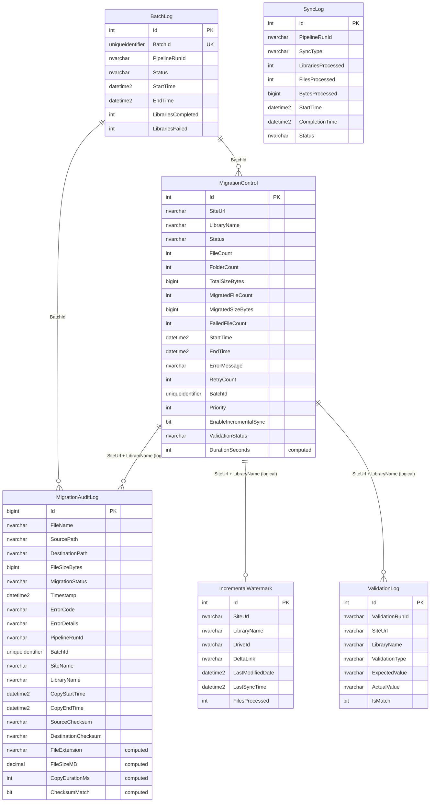

# Hydro One SharePoint Migration - SQL Database Schema

This document describes the SQL Server schema used by the migration solution,
hosted in `sql-hydroone-migration-test` (Canada Central).

---

## Entity Relationship Diagram

---

## Table Descriptions

### MigrationControl

**Purpose:** Stores one row per SharePoint document library to be migrated, tracking status and progress.

| Column                 | Type                  | Description                                          |
|------------------------|-----------------------|------------------------------------------------------|
| Id                     | int (identity)        | Primary key                                          |
| SiteUrl                | nvarchar(500)         | SharePoint site URL                                  |
| LibraryName            | nvarchar(255)         | Document library display name                        |
| Status                 | nvarchar(50)          | Pending, InProgress, Completed, Failed               |
| FileCount              | int                   | Total files discovered in source                     |
| FolderCount            | int                   | Total folders discovered in source                   |
| TotalSizeBytes         | bigint                | Total size of all source files in bytes              |
| MigratedFileCount      | int                   | Files successfully copied                            |
| MigratedSizeBytes      | bigint                | Bytes successfully copied                            |
| FailedFileCount        | int                   | Files that failed to copy                            |
| StartTime              | datetime2             | Migration start timestamp                            |
| EndTime                | datetime2             | Migration end timestamp                              |
| ErrorMessage           | nvarchar(max)         | Last error message (if any)                          |
| RetryCount             | int                   | Number of retry attempts                             |
| BatchId                | uniqueidentifier      | FK to BatchLog; groups libraries per run             |
| Priority               | int                   | Execution priority (lower = higher priority)         |
| EnableIncrementalSync  | bit                   | Whether incremental sync is enabled for this library |
| ValidationStatus       | nvarchar(50)          | Passed, Failed, Pending                              |
| DurationSeconds        | int (computed)        | `DATEDIFF(SECOND, StartTime, EndTime)`               |

**Indexes:** PK on `Id`, nonclustered on `(Status, Priority)`, nonclustered on `BatchId`.
**Constraints:** `Status` defaults to `'Pending'`, `RetryCount` defaults to `0`.

---

### MigrationAuditLog

**Purpose:** Records one row per file copy attempt, providing a complete audit trail.

| Column               | Type                  | Description                                              |
|----------------------|-----------------------|----------------------------------------------------------|
| Id                   | bigint (identity)     | Primary key                                              |
| FileName             | nvarchar(500)         | Source file name                                         |
| SourcePath           | nvarchar(2000)        | Full Graph API path of the source file                   |
| DestinationPath      | nvarchar(2000)        | ADLS Gen2 blob path                                      |
| FileSizeBytes        | bigint                | File size in bytes                                       |
| MigrationStatus      | nvarchar(50)          | Success, Failed, Skipped                                 |
| Timestamp            | datetime2             | When the audit row was written                           |
| ErrorCode            | nvarchar(50)          | HTTP status code or ADF error code                       |
| ErrorDetails         | nvarchar(max)         | Full error message                                       |
| PipelineRunId        | nvarchar(100)         | ADF pipeline run identifier                              |
| BatchId              | uniqueidentifier      | FK to BatchLog                                           |
| SiteName             | nvarchar(255)         | SharePoint site name (logical FK to MigrationControl)    |
| LibraryName          | nvarchar(255)         | Library name (logical FK to MigrationControl)            |
| CopyStartTime        | datetime2             | Copy activity start timestamp                            |
| CopyEndTime          | datetime2             | Copy activity end timestamp                              |
| SourceChecksum       | nvarchar(64)          | SHA-256 hash of source file                              |
| DestinationChecksum  | nvarchar(64)          | SHA-256 hash of destination file                         |
| FileExtension        | nvarchar(20) (computed) | `RIGHT(FileName, CHARINDEX('.', REVERSE(FileName)) - 1)` |
| FileSizeMB           | decimal(18,2) (computed) | `CAST(FileSizeBytes / 1048576.0 AS DECIMAL(18,2))`    |
| CopyDurationMs       | int (computed)        | `DATEDIFF(MILLISECOND, CopyStartTime, CopyEndTime)`     |
| ChecksumMatch        | bit (computed)        | `CASE WHEN SourceChecksum = DestinationChecksum THEN 1 ELSE 0 END` |

**Indexes:** PK on `Id`, nonclustered on `(BatchId, MigrationStatus)`, nonclustered on `Timestamp`.
**Constraints:** `Timestamp` defaults to `SYSUTCDATETIME()`.

---

### IncrementalWatermark

**Purpose:** Persists the Graph delta query deltaLink per library so incremental syncs resume from the last known state.

| Column            | Type              | Description                                  |
|-------------------|-------------------|----------------------------------------------|
| Id                | int (identity)    | Primary key                                  |
| SiteUrl           | nvarchar(500)     | SharePoint site URL                          |
| LibraryName       | nvarchar(255)     | Document library name                        |
| DriveId           | nvarchar(255)     | Graph API drive identifier                   |
| DeltaLink         | nvarchar(max)     | Opaque deltaLink URL from Graph delta query  |
| LastModifiedDate  | datetime2         | Most recent file modification seen           |
| LastSyncTime      | datetime2         | When the last sync completed                 |
| FilesProcessed    | int               | Files processed in last sync                 |

**Indexes:** PK on `Id`, unique nonclustered on `(SiteUrl, LibraryName)`.
**Constraints:** None beyond PK and unique index.

---

### BatchLog

**Purpose:** Tracks each pipeline batch execution, grouping all libraries processed in a single run.

| Column              | Type                 | Description                        |
|---------------------|----------------------|------------------------------------|
| Id                  | int (identity)       | Primary key                        |
| BatchId             | uniqueidentifier     | Unique batch identifier            |
| PipelineRunId       | nvarchar(100)        | ADF master pipeline run ID         |
| Status              | nvarchar(50)         | InProgress, Completed, Failed      |
| StartTime           | datetime2            | Batch start timestamp              |
| EndTime             | datetime2            | Batch end timestamp                |
| LibrariesCompleted  | int                  | Count of successfully migrated libs|
| LibrariesFailed     | int                  | Count of failed libs               |

**Indexes:** PK on `Id`, unique nonclustered on `BatchId`.
**Constraints:** `BatchId` defaults to `NEWID()`, `Status` defaults to `'InProgress'`.

---

### SyncLog

**Purpose:** Records each incremental sync run with aggregate metrics.

| Column              | Type              | Description                              |
|---------------------|-------------------|------------------------------------------|
| Id                  | int (identity)    | Primary key                              |
| PipelineRunId       | nvarchar(100)     | ADF pipeline run ID                      |
| SyncType            | nvarchar(50)      | Full, Incremental                        |
| LibrariesProcessed  | int               | Number of libraries synced               |
| FilesProcessed      | int               | Total files processed                    |
| BytesProcessed      | bigint            | Total bytes transferred                  |
| StartTime           | datetime2         | Sync start timestamp                     |
| CompletionTime      | datetime2         | Sync completion timestamp                |
| Status              | nvarchar(50)      | Completed, Failed, PartiallyCompleted    |

**Indexes:** PK on `Id`, nonclustered on `PipelineRunId`.
**Constraints:** `StartTime` defaults to `SYSUTCDATETIME()`.

---

### ValidationLog

**Purpose:** Stores results of post-migration validation checks (file count, total size).

| Column           | Type              | Description                               |
|------------------|-------------------|-------------------------------------------|
| Id               | int (identity)    | Primary key                               |
| ValidationRunId  | nvarchar(100)     | Groups validations from a single run      |
| SiteUrl          | nvarchar(500)     | SharePoint site URL                       |
| LibraryName      | nvarchar(255)     | Document library name                     |
| ValidationType   | nvarchar(50)      | FileCount, TotalSizeBytes                 |
| ExpectedValue    | nvarchar(100)     | Value from source (Graph API)             |
| ActualValue      | nvarchar(100)     | Value from destination (ADLS)             |
| IsMatch          | bit               | 1 if ExpectedValue = ActualValue          |

**Indexes:** PK on `Id`, nonclustered on `ValidationRunId`.
**Constraints:** None beyond PK.

---

## Stored Procedures

| Procedure                  | Purpose                                              | Key Parameters                                         | Called By                          |
|----------------------------|------------------------------------------------------|--------------------------------------------------------|------------------------------------|
| `usp_UpdateMigrationStatus`| Updates library status and counters in MigrationControl | `@Id`, `@Status`, `@MigratedFileCount`, `@ErrorMessage` | PL_Migrate_Single_Library         |
| `usp_LogBatchStart`        | Inserts a new BatchLog row when orchestrator starts  | `@BatchId`, `@PipelineRunId`                           | PL_Master_Migration_Orchestrator   |
| `usp_LogBatchComplete`     | Marks batch as Completed/Failed with final counts    | `@BatchId`, `@Status`, `@LibrariesCompleted`, `@LibrariesFailed` | PL_Master_Migration_Orchestrator |
| `usp_UpdateValidationStatus`| Sets ValidationStatus on MigrationControl           | `@Id`, `@ValidationStatus`                             | PL_Validation                      |
| `usp_LogValidationResult`  | Inserts a row into ValidationLog                     | `@ValidationRunId`, `@SiteUrl`, `@LibraryName`, `@ValidationType`, `@ExpectedValue`, `@ActualValue` | PL_Validation |
| `usp_UpdateWatermark`      | Upserts deltaLink and DriveId into IncrementalWatermark | `@SiteUrl`, `@LibraryName`, `@DriveId`, `@DeltaLink`, `@FilesProcessed` | PL_Incremental_Sync |
| `usp_LogSyncRun`           | Inserts or updates a SyncLog row                     | `@PipelineRunId`, `@SyncType`, `@FilesProcessed`, `@BytesProcessed`, `@Status` | PL_Incremental_Sync |
| `usp_LogFileAudit`         | Inserts a single row into MigrationAuditLog          | `@FileName`, `@SourcePath`, `@DestinationPath`, `@FileSizeBytes`, `@MigrationStatus`, `@BatchId` | PL_Copy_File_Batch |
| `usp_BulkLogFileAudit`     | Bulk-inserts audit rows using a table-valued parameter| `@AuditEntries` (TVP), `@BatchId`                      | PL_Copy_File_Batch (batch mode)    |

---

## Computed Columns

The following columns are persisted computed columns, calculated automatically by SQL Server:

| Table              | Column           | Expression                                                          |
|--------------------|------------------|---------------------------------------------------------------------|
| MigrationControl   | DurationSeconds  | `DATEDIFF(SECOND, StartTime, EndTime)`                              |
| MigrationAuditLog  | FileExtension    | `RIGHT(FileName, CHARINDEX('.', REVERSE(FileName)) - 1)`            |
| MigrationAuditLog  | FileSizeMB       | `CAST(FileSizeBytes / 1048576.0 AS DECIMAL(18,2))`                  |
| MigrationAuditLog  | CopyDurationMs   | `DATEDIFF(MILLISECOND, CopyStartTime, CopyEndTime)`                 |
| MigrationAuditLog  | ChecksumMatch    | `CASE WHEN SourceChecksum = DestinationChecksum THEN 1 ELSE 0 END`  |

These columns are persisted so they can be indexed and queried without runtime computation overhead.
