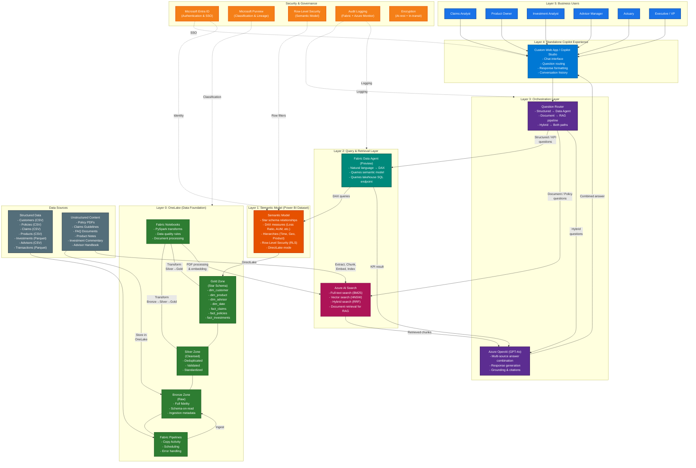

# Manulife Fabric POC -- Architecture Diagrams

This document contains three Mermaid diagrams that visualize the reference architecture
for the Manulife Microsoft Fabric POC.

> **Rendering:** These diagrams use [Mermaid](https://mermaid.js.org/) syntax. They
> render natively in GitHub, Azure DevOps, Notion, and most modern Markdown viewers.
> For local rendering, use the Mermaid Live Editor at https://mermaid.live.

---

## Diagram 1: End-to-End Logical Architecture

This diagram shows the complete architecture from business users at the top down to
data sources at the bottom. The positioning reflects the design principle that the
semantic model is the brain, OneLake is the foundation, and the Copilot experience
is what users interact with.

---

## Diagram 2: Data Flow

This diagram shows the two parallel data flows:
1. Structured data through the medallion architecture to the semantic model and Data Agent
2. Unstructured documents through the RAG pipeline to Azure AI Search

Both paths converge at the orchestration layer to deliver combined answers.

```mermaid
flowchart LR
    %% -------------------------------------------------------
    %% STYLES
    %% -------------------------------------------------------
    classDef sourceStyle fill:#546e7a,stroke:#37474f,color:#fff,stroke-width:2px
    classDef bronzeStyle fill:#795548,stroke:#4e342e,color:#fff,stroke-width:2px
    classDef silverStyle fill:#78909c,stroke:#455a64,color:#fff,stroke-width:2px
    classDef goldStyle fill:#f9a825,stroke:#f57f17,color:#000,stroke-width:2px
    classDef semanticStyle fill:#e65100,stroke:#bf360c,color:#fff,stroke-width:2px
    classDef agentStyle fill:#00897b,stroke:#004d40,color:#fff,stroke-width:2px
    classDef searchStyle fill:#ad1457,stroke:#880e4f,color:#fff,stroke-width:2px
    classDef orchStyle fill:#5c2d91,stroke:#3b1560,color:#fff,stroke-width:2px
    classDef userStyle fill:#1a73e8,stroke:#0d47a1,color:#fff,stroke-width:2px
    classDef pipeStyle fill:#2e7d32,stroke:#1b5e20,color:#fff,stroke-width:2px
    classDef nbStyle fill:#0277bd,stroke:#01579b,color:#fff,stroke-width:2px

    %% -------------------------------------------------------
    %% STRUCTURED DATA FLOW (Top path)
    %% -------------------------------------------------------
    subgraph STRUCTURED_FLOW["Structured Data Flow (Medallion Architecture)"]
        direction LR

        S_SRC["Raw Sources\n- Customers CSV\n- Policies CSV\n- Claims CSV\n- Products CSV\n- Investments Parquet\n- Advisors CSV\n- Transactions Parquet"]:::sourceStyle

        S_PIPE["Fabric Pipelines\n- Copy Activity\n- Incremental load\n- Watermark tracking\n- Error handling"]:::pipeStyle

        S_BRONZE["Bronze Zone\n(Raw Delta Tables)\n- Full fidelity\n- Ingestion metadata\n- Schema-on-read"]:::bronzeStyle

        S_NB1["Notebook:\nBronze → Silver\n- Deduplicate\n- Type cast\n- Validate nulls\n- Standardize codes\n- Log rejects"]:::nbStyle

        S_SILVER["Silver Zone\n(Cleansed Delta Tables)\n- Conformed schema\n- Quality-checked\n- Standardized"]:::silverStyle

        S_NB2["Notebook:\nSilver → Gold\n- Star schema\n- Surrogate keys\n- SCD Type 2\n- Aggregations"]:::nbStyle

        S_GOLD["Gold Zone\n(Star Schema)\n- dim_customer\n- dim_product\n- dim_date\n- fact_claims\n- fact_policies\n- fact_investments"]:::goldStyle

        S_SM["Semantic Model\n(Power BI Dataset)\n- DAX measures\n- Relationships\n- Hierarchies\n- RLS\n- DirectLake"]:::semanticStyle

        S_DA["Fabric Data Agent\n- NL → DAX\n- Query execution\n- Result formatting"]:::agentStyle
    end

    %% Structured flow connections
    S_SRC -->|"1. Source files\navailable"| S_PIPE
    S_PIPE -->|"2. Ingest to\nOneLake"| S_BRONZE
    S_BRONZE -->|"3. Read raw\ndata"| S_NB1
    S_NB1 -->|"4. Write cleansed\ndata"| S_SILVER
    S_SILVER -->|"5. Read cleansed\ndata"| S_NB2
    S_NB2 -->|"6. Write curated\nstar schema"| S_GOLD
    S_GOLD -->|"7. DirectLake\nconnection"| S_SM
    S_SM -->|"8. DAX query\nexecution"| S_DA

    %% -------------------------------------------------------
    %% UNSTRUCTURED DATA FLOW (Bottom path)
    %% -------------------------------------------------------
    subgraph UNSTRUCTURED_FLOW["Unstructured Data Flow (RAG Pipeline)"]
        direction LR

        U_SRC["Document Sources\n- Policy PDFs\n- Claims Guidelines\n- FAQ Documents\n- Product Notes\n- Investment Commentary\n- Advisor Handbook"]:::sourceStyle

        U_EXTRACT["Document Processing\n(Fabric Notebook)\n- PDF text extraction\n- OCR if needed\n- Metadata extraction"]:::nbStyle

        U_CHUNK["Text Chunking\n- 512-token chunks\n- 128-token overlap\n- Preserve metadata\n(doc, page, section)"]:::nbStyle

        U_EMBED["Azure OpenAI\nEmbeddings\n- text-embedding-3-small\n- 1536 dimensions\n- Batch processing"]:::orchStyle

        U_INDEX["Azure AI Search\nIndex\n- Text field (BM25)\n- Vector field (HNSW)\n- Metadata fields\n- Security filters"]:::searchStyle

        U_RETRIEVE["Hybrid Retrieval\n- Keyword + vector\n- RRF score fusion\n- Top-K selection\n- Security trimming"]:::searchStyle
    end

    %% Unstructured flow connections
    U_SRC -->|"1. Upload\ndocuments"| U_EXTRACT
    U_EXTRACT -->|"2. Extracted\ntext"| U_CHUNK
    U_CHUNK -->|"3. Text\nchunks"| U_EMBED
    U_EMBED -->|"4. Chunks +\nembeddings"| U_INDEX
    U_INDEX -->|"5. Search\nquery"| U_RETRIEVE

    %% -------------------------------------------------------
    %% CONVERGENCE
    %% -------------------------------------------------------
    subgraph CONVERGENCE["Answer Orchestration"]
        direction LR
        ORCH_LAYER["Azure OpenAI (GPT-4o)\n- Combine structured KPI\n  with document context\n- Generate unified response\n- Add citations"]:::orchStyle
        COPILOT["Copilot Experience\n- Display answer\n- Show tables/charts\n- Show citations\n- Enable follow-ups"]:::userStyle
        USER["Business User"]:::userStyle
    end

    %% Convergence connections
    S_DA -->|"9. KPI answer\n(structured)"| ORCH_LAYER
    U_RETRIEVE -->|"6. Retrieved\nchunks"| ORCH_LAYER
    ORCH_LAYER -->|"10. Combined\nresponse"| COPILOT
    COPILOT -->|"11. Formatted\nanswer"| USER
```

---

## Diagram 3: Component Integration

This diagram shows how each component communicates with the others, including
protocols, APIs, and data formats. OneLake is positioned as the central storage
layer and the semantic model as the central business logic layer.

```mermaid
flowchart TB
    %% -------------------------------------------------------
    %% STYLES
    %% -------------------------------------------------------
    classDef coreStyle fill:#e65100,stroke:#bf360c,color:#fff,stroke-width:3px
    classDef storageStyle fill:#2e7d32,stroke:#1b5e20,color:#fff,stroke-width:3px
    classDef computeStyle fill:#0277bd,stroke:#01579b,color:#fff,stroke-width:2px
    classDef aiStyle fill:#5c2d91,stroke:#3b1560,color:#fff,stroke-width:2px
    classDef interfaceStyle fill:#1a73e8,stroke:#0d47a1,color:#fff,stroke-width:2px
    classDef securityStyle fill:#f57f17,stroke:#e65100,color:#000,stroke-width:2px
    classDef externalStyle fill:#546e7a,stroke:#37474f,color:#fff,stroke-width:2px

    %% -------------------------------------------------------
    %% USER INTERFACE LAYER
    %% -------------------------------------------------------
    subgraph UI_LAYER["User Interface Layer"]
        WEBAPP["Custom Web App\n(React / Next.js)\n---\nProtocol: HTTPS\nAuth: Entra ID SSO\nFormat: JSON"]:::interfaceStyle
        PBI["Power BI Reports\n(Embedded)\n---\nProtocol: HTTPS\nAuth: Entra ID SSO\nFormat: Visual"]:::interfaceStyle
    end

    %% -------------------------------------------------------
    %% ORCHESTRATION LAYER
    %% -------------------------------------------------------
    subgraph ORCH_LAYER["Orchestration Layer"]
        AOAI_ORCH["Azure OpenAI\n(GPT-4o)\n---\nAPI: REST (chat/completions)\nAuth: API Key / Managed Identity\nRegion: Canada East"]:::aiStyle
        APP_LOGIC["Application Backend\n(Azure Functions / App Service)\n---\nRuntime: Python 3.11\nFramework: LangChain / Semantic Kernel\nRouting: Intent classification"]:::aiStyle
    end

    %% -------------------------------------------------------
    %% QUERY LAYER
    %% -------------------------------------------------------
    subgraph QUERY_LAYER["Query & Retrieval Layer"]
        DATA_AGENT["Fabric Data Agent\n(Preview)\n---\nAPI: Fabric REST API\nQuery: Natural Language → DAX\nTarget: Semantic Model"]:::aiStyle
        AI_SEARCH["Azure AI Search\n(Standard Tier)\n---\nAPI: REST (search/documents)\nAuth: API Key / Managed Identity\nIndex: Hybrid (BM25 + HNSW)"]:::aiStyle
    end

    %% -------------------------------------------------------
    %% SEMANTIC LAYER (THE BRAIN)
    %% -------------------------------------------------------
    SM["SEMANTIC MODEL\n(Power BI Dataset)\n---\nMode: DirectLake\nQuery: DAX\nSecurity: RLS\nMeasures: Loss Ratio, AUM,\nClaims Processing Days, etc.\n---\nTHIS IS THE BRAIN"]:::coreStyle

    %% -------------------------------------------------------
    %% ONELAKE (THE FOUNDATION)
    %% -------------------------------------------------------
    subgraph ONELAKE_LAYER["OneLake (Data Foundation)"]
        OL_GOLD["Gold Zone\n(Star Schema)\n---\nFormat: Delta Lake\nAccess: ABFSS + SQL Endpoint\nTables: dim_*, fact_*"]:::storageStyle
        OL_SILVER["Silver Zone\n(Cleansed)\n---\nFormat: Delta Lake\nAccess: ABFSS\nQuality: Validated"]:::storageStyle
        OL_BRONZE["Bronze Zone\n(Raw)\n---\nFormat: Delta Lake\nAccess: ABFSS\nFidelity: Full source copy"]:::storageStyle
        OL_DOCS["Document Storage\n---\nFormat: PDF, DOCX\nAccess: OneLake File API\nPurpose: Governance lineage"]:::storageStyle
    end

    %% -------------------------------------------------------
    %% COMPUTE LAYER
    %% -------------------------------------------------------
    subgraph COMPUTE_LAYER["Compute Layer"]
        PIPELINES["Fabric Pipelines\n---\nActivities: Copy, ForEach\nSchedule: Daily / On-demand\nProtocol: ABFSS write"]:::computeStyle
        NOTEBOOKS["Fabric Notebooks\n---\nRuntime: PySpark / Python\nLibraries: Delta, pandas, openai\nTrigger: Pipeline orchestration"]:::computeStyle
    end

    %% -------------------------------------------------------
    %% EMBEDDING SERVICE
    %% -------------------------------------------------------
    AOAI_EMBED["Azure OpenAI\n(Embeddings)\n---\nModel: text-embedding-3-small\nAPI: REST (embeddings)\nDimensions: 1536"]:::aiStyle

    %% -------------------------------------------------------
    %% SOURCE SYSTEMS
    %% -------------------------------------------------------
    subgraph SOURCES["Source Systems"]
        CSV_FILES["CSV / Parquet Files\n(Structured Data)\n---\n7 entity types\n< 10 GB total"]:::externalStyle
        PDF_FILES["PDF / DOCX Files\n(Unstructured Content)\n---\n~450 documents\nPolicy, Claims, FAQ"]:::externalStyle
    end

    %% -------------------------------------------------------
    %% SECURITY
    %% -------------------------------------------------------
    subgraph SECURITY["Security & Governance"]
        ENTRA["Microsoft Entra ID\n---\nSSO, RBAC, Groups\nConditional Access"]:::securityStyle
        PURVIEW["Microsoft Purview\n---\nData Classification\nLineage Tracking\nSensitivity Labels"]:::securityStyle
        KV["Azure Key Vault\n---\nAPI Keys, Secrets\nConnection Strings\nManaged Identity"]:::securityStyle
        MONITOR["Azure Monitor\n---\nAudit Logs\nAlerts\nDiagnostics"]:::securityStyle
    end

    %% -------------------------------------------------------
    %% CONNECTIONS: User Interface → Orchestration
    %% -------------------------------------------------------
    WEBAPP -->|"HTTPS\nJSON request"| APP_LOGIC
    PBI -->|"HTTPS\nEmbed API"| SM

    %% -------------------------------------------------------
    %% CONNECTIONS: Orchestration → Query
    %% -------------------------------------------------------
    APP_LOGIC -->|"Fabric REST API\n(structured questions)"| DATA_AGENT
    APP_LOGIC -->|"REST API\n(document questions)"| AI_SEARCH
    APP_LOGIC -->|"REST API\nchat/completions\n(answer generation)"| AOAI_ORCH
    AI_SEARCH -->|"Retrieved chunks\n(JSON)"| AOAI_ORCH
    DATA_AGENT -->|"KPI result\n(JSON)"| APP_LOGIC
    AOAI_ORCH -->|"Generated answer\n(JSON)"| APP_LOGIC

    %% -------------------------------------------------------
    %% CONNECTIONS: Query → Semantic Model
    %% -------------------------------------------------------
    DATA_AGENT -->|"DAX query\n(XMLA endpoint)"| SM

    %% -------------------------------------------------------
    %% CONNECTIONS: Semantic Model → OneLake
    %% -------------------------------------------------------
    SM -->|"DirectLake read\n(ABFSS / Delta)"| OL_GOLD

    %% -------------------------------------------------------
    %% CONNECTIONS: Compute → OneLake
    %% -------------------------------------------------------
    PIPELINES -->|"Copy Activity\n(ABFSS write)"| OL_BRONZE
    NOTEBOOKS -->|"PySpark read/write\n(ABFSS)"| OL_BRONZE
    NOTEBOOKS -->|"PySpark write\n(ABFSS)"| OL_SILVER
    NOTEBOOKS -->|"PySpark write\n(ABFSS)"| OL_GOLD
    NOTEBOOKS -->|"Read docs\n(OneLake File API)"| OL_DOCS
    OL_BRONZE -->|"Delta read"| NOTEBOOKS
    OL_SILVER -->|"Delta read"| NOTEBOOKS
    PIPELINES -->|"Trigger\nnotebook run"| NOTEBOOKS

    %% -------------------------------------------------------
    %% CONNECTIONS: Sources → Compute
    %% -------------------------------------------------------
    CSV_FILES -->|"File read"| PIPELINES
    PDF_FILES -->|"File read"| NOTEBOOKS
    PDF_FILES -->|"Store copy"| OL_DOCS

    %% -------------------------------------------------------
    %% CONNECTIONS: Notebooks → AI Search (document indexing)
    %% -------------------------------------------------------
    NOTEBOOKS -->|"REST API\n(index documents)"| AI_SEARCH
    NOTEBOOKS -->|"REST API\n(generate embeddings)"| AOAI_EMBED
    AOAI_EMBED -->|"Embedding vectors\n(1536 dims)"| NOTEBOOKS

    %% -------------------------------------------------------
    %% CONNECTIONS: Security (dashed = governance overlay)
    %% -------------------------------------------------------
    ENTRA -.->|"SSO / OAuth 2.0"| WEBAPP
    ENTRA -.->|"Identity pass-through"| SM
    ENTRA -.->|"RBAC"| ONELAKE_LAYER
    PURVIEW -.->|"Classification\n& lineage"| ONELAKE_LAYER
    PURVIEW -.->|"Sensitivity\nlabels"| SM
    KV -.->|"Secrets"| APP_LOGIC
    KV -.->|"API keys"| NOTEBOOKS
    MONITOR -.->|"Audit logs"| ORCH_LAYER
    MONITOR -.->|"Diagnostics"| COMPUTE_LAYER
    MONITOR -.->|"Query logs"| QUERY_LAYER
```

---

## Diagram Legend

| Symbol / Color   | Meaning                                                   |
|------------------|-----------------------------------------------------------|
| Orange (bold)    | Semantic Model -- the business logic layer ("the brain")  |
| Green            | OneLake -- the data foundation (storage)                  |
| Blue (light)     | Compute (Fabric Pipelines, Notebooks)                     |
| Purple           | AI services (Azure OpenAI, orchestration)                 |
| Blue (dark)      | User interface (Copilot, web app)                         |
| Pink/Magenta     | Azure AI Search (document retrieval)                      |
| Yellow/Amber     | Security and governance                                   |
| Gray             | External sources (CSV, PDF files)                         |
| Solid lines      | Data flow / API calls                                     |
| Dashed lines     | Governance / security overlay                             |

---

## Key Architectural Relationships

### OneLake as Central Storage
All structured data flows through OneLake (Bronze, Silver, Gold zones). The semantic
model reads from OneLake Gold zone via DirectLake. Unstructured documents are stored
in OneLake for governance lineage even though they are indexed in Azure AI Search
for retrieval.

### Semantic Model as Business Logic
The Data Agent does **not** query raw lakehouse tables for KPI answers. It queries the
semantic model, which contains DAX measures that encode business logic. This ensures
consistent, governed KPI definitions regardless of who asks or how they phrase the
question.

### Dual Query Paths
The architecture supports two query paths that converge at the orchestration layer:
1. **Structured path**: User question → Data Agent → DAX → Semantic Model → KPI answer
2. **Unstructured path**: User question → AI Search → Retrieved chunks → Azure OpenAI → Document answer

The orchestration layer (Azure OpenAI + application backend) combines both paths for
hybrid questions that need both a KPI value and document context.

### Security at Every Layer
Security is not bolted on -- it is woven through the architecture:
- **Authentication**: Entra ID SSO at the web app layer
- **Authorization**: Workspace roles in Fabric, RBAC in Azure
- **Data security**: RLS in the semantic model filters rows based on user identity
- **Document security**: Security filters in Azure AI Search trim results
- **Secrets management**: Azure Key Vault stores all API keys and connection strings
- **Audit**: Azure Monitor captures all access and query events

---

*End of Architecture Diagrams*
